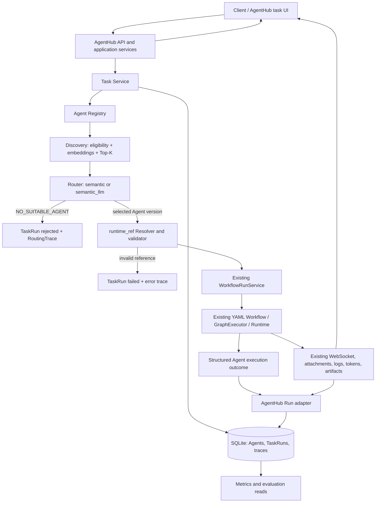

# AgentHub 技术设计冻结（Phase 1）

Status: Design Frozen for P0 Implementation

本文冻结 AgentHub 的 P0 业务边界和技术方案；不代表功能已经实现，也不包含迁移、路由参数或基准测量结果。

## 1. 目标、依据与边界

AgentHub 是包在 ChatDev Runtime 外围的 Agent 平台扩展，完成业务 Agent 登记、能力发现、单 Agent 路由、运行关联、观测和评测。普通新增 Agent 通过元数据和受控运行引用加入目录，Router 不包含 demo Agent 名称分支。

本设计依据仓库中的 `AGENTS.md`、`ARCHITECTURE_RECON.md` 和 `DEVELOPMENT_BASELINE.md`。架构事实对应 OpenBMB/ChatDev 固定提交 [`4fb2db0ea90375ce1059f44fe03ffbd191a7a169`](https://github.com/OpenBMB/ChatDev/commit/4fb2db0ea90375ce1059f44fe03ffbd191a7a169)，不是对未来上游版本的保证。

已验证且作为硬约束的事实：运行时 Agent 是 `Node(type="agent") + AgentConfig`；`AgentConfig.name` 是模型名、`role` 是 system prompt；图由 YAML 配置并由现有 Workflow/Runtime 执行；现有 node/provider/schema registry 不是业务 Agent Registry；Web session store 是进程内存；`WorkflowRunService` 是 Web workflow 主路径；provider 异常可能被包装成 assistant 错误文本而 workflow 仍报告成功。因此 `workflow_completed != execution_success`。

## Frozen P0 Decisions

| 主题 | P0 决策 | 主要理由 |
| --- | --- | --- |
| 业务边界 | 新增应用服务层 AgentHub 服务；在 `WorkflowRunService` 前完成发现、路由、拒绝和引用解析 | 不侵入图调度，不重写 Runtime |
| Agent 执行单元 | 一个已登记业务 Agent 对应一个预验证、薄的 ChatDev workflow；每个 workflow 恰有一个业务 Agent 节点 | 与现有 YAML 执行入口相容、运行含义明确 |
| 存储 | 单机 SQLite，业务数据与现有 `vuegraphs` 数据分开 | 结构化查询、事务和重启持久化足够，部署负担低 |
| 发现 | 使用可替换 embedding 接口和小目录内精确 Top-K；P0 不建向量服务 | 满足语义召回，目录规模不足以证明独立向量库必要 |
| 执行成功 | 在 Runtime 执行上下文中旁路记录结构化 Agent outcome；保留旧错误文本和旧 workflow 行为 | 不解析自然语言错误，不把控制流完成误算成功 |
| 信任边界 | P0 面向可信开发者、本地或内部可信环境；不开放不可信公共 Agent 注册，不做多租户或复杂 RBAC；runtime_ref 由服务端控制并 allowlist | 与 MVP 范围相符，同时约束继承的代码/工具执行面 |
| Embedding | `EmbeddingBackend` provider-agnostic；实现与测试用确定性 fake backend；live integration/demo benchmark 前需配置真实 OpenAI-compatible endpoint | 真实服务是集成配置，不阻塞 P0 开发启动 |
| Benchmark | 初始约 60 例：36 清晰路由、12 模糊/重叠能力、12 no-match；报告 Reject Accuracy 与 False Accept Rate | 明确覆盖拒绝行为，阈值依据标注证据选择 |
| 结果指标 | 结构化 Agent 执行用 Execution Success Rate；答案/任务质量只在有断言、rubric 或人工判断时用 Task Quality Success Rate | 分开控制流/执行完成与实际结果质量 |
| 前端 | 增加轻量 AgentHub 任务入口/模式并复用 Launch 结果组件 | 保持现有手选 workflow 路径可用 |

本节列出的方案是 P0 冻结决定。Endpoint/model、API 路径和模块路径仍按部署配置或实现细节落地，不构成额外架构前置条件。

## 2. 系统架构



| 区域 | AgentHub 新职责 | 复用的 ChatDev 职责 |
| --- | --- | --- |
| API / application services | 任务提交、Registry 生命周期、路由、受控引用解析、TaskRun/Trace 写入 | FastAPI 初始化与路由汇总模式 |
| Registry / Discovery / Router | 业务 ID、能力文本、状态过滤、召回、重排、拒绝 | 不复用 `node_registry`、`ProviderRegistry` 或 `schema_registry` 作为业务目录 |
| 执行 | 把已选择的 runtime_ref 解析成已校验 workflow，建立业务 run 到 session 的关联 | `WorkflowRunService`、`WebSocketGraphExecutor`、`GraphExecutor`、Provider、ToolManager |
| 观测 | 业务状态、路由 trace、运行到 Agent/version 的关联、指标聚合 | WebSocket 消息、附件/产物、`WorkflowLogger`、`LogManager`、`TokenTracker`、`ResultArchiver` |
| UI | 自然语言提交、候选摘要、AgentHub 状态与轻量指标 | Launch 页已有执行状态、节点/输出/附件展示组件 |

数据流：任务被接受后先建立 `TaskRun`；Registry 返回符合条件的已启用 Agent 版本；Discovery 生成候选；Router 选择一个候选或拒绝；Resolver 校验运行引用；适配器调用原 workflow 服务；结构化 outcome、native session 状态和已有观测数据共同更新 AgentHub 投影。

控制流：路由拒绝和引用无效发生在 Workflow 启动前；选中后只通过现有 workflow 执行路径运行。AgentHub 不进入 `DAGExecutor` 做全局检索，也不直接调用 Provider。

**决策**：保持服务层前置路由，运行时旁路业务记录。**理由**：与调查中的 `server/services` / `WorkflowRunService` 边界一致。**替代方案**：在图调度器/节点分发处加入 Agent Registry；P0 拒绝，因为会把业务查找耦合进通用执行引擎。**未来扩展**：如需跨服务执行，可保持业务接口并替换内部 adapter，不改变 AgentMetadata 和 Run 语义。

## 3. AgentMetadata 合约

业务 Agent 是一个有稳定平台身份、不可变元数据版本和受控执行引用的目录实体。业务名称与 `AgentConfig.name`（模型名）严格区分；业务 capability 也不从 role/system prompt 自动推断。

| 字段 | 必需 | 目的与校验 | 发现/路由用途 |
| --- | --- | --- | --- |
| `id` | 是 | 注册时生成 UUID；更新不可更改；不由模型名、node ID 或 provider ID 派生 | 关联、过滤与 trace ID；本身不参与语义评分 |
| `name` | 是 | 面向用户的短名称；去除首尾空白，限制长度，非空 | 纳入 Agent 文本表示；只作展示和匹配文本 |
| `description` | 是 | 面向使用者的职责边界；去除空白，限制长度，禁止凭空加入秘密 | 纳入语义文本表示 |
| `capabilities` | 是 | 非空、去重的能力短句列表；每项非空并限制长度；由 Agent 提供者明确维护 | 主要语义内容，逐项连接成能力文本 |
| `tools` | 否 | 可选的工具名称/能力标签列表；仅作描述，不放凭据、MCP URL 或运行配置 | P0 纳入文本表示的次要字段；不作为工具授权 |
| `tags` | 否 | 规范化、去重的简短标签 | 纳入语义文本；可作为过滤/展示字段 |
| `version` | 是 | 同一 `id` 下单调递增整数；注册为 1，每次 metadata/runtime_ref 更新产生新版本 | 不直接参与相似度；Trace 固定版本 |
| `status` | 是 | `active` / `disabled`；可变的目录级启停状态，不改变不可变版本快照 | `disabled` 必须在向 Discovery 提供候选前剔除 |
| `runtime_ref` | 是 | 受控的逻辑引用（见第 5 节）；禁止路径、URL 或任意 YAML 文本 | 执行选择使用，不加入用户能力相似度文本 |
| `created_at` | 是 | UTC ISO-8601 时间戳 | 不参与路由 |
| `updated_at` | 是 | UTC ISO-8601 时间戳；状态更改也更新 | 不参与路由 |

版本语义：Agent `id` 永久标识同一业务能力入口；名字/描述/能力/工具/标签/runtime_ref 的更新生成新的不可变版本快照。`status` 属于身份记录上的可变开关，因此禁用/启用不制造新能力版本。AgentRun 和 RoutingTrace 均保存选择时的 `agent_id + version` 与受控 runtime_ref 快照，后续更新不改写历史。

**决策**：UUID 身份、整数版本、metadata 快照不可变、status 单独启停。**理由**：防止名称或模型配置变化破坏外键与历史可复现性。**替代方案**：用名称作为 ID、用 SemVer 表示每次内容更新；P0 不需要人类可读身份或兼容性承诺矩阵。**未来扩展**：可在不变更 UUID 的情况下加 SemVer 标签、作者或发布时间。

## 4. Agent 生命周期

P0 操作：

- **Register**：验证字段、版本初值、runtime_ref 和 workflow；成功后以 `active` 注册并生成 metadata embedding。验证/索引未完成时不应暴露为可路由候选。
- **Update**：保留 `id`，产生下一整数版本；先验证并为新版本建索引，再原子切换 current version。失败不覆盖旧版。当前为 `disabled` 的 Agent 更新后仍保持 disabled。
- **Get**：按稳定 ID 取当前版本与状态；历史版本按需只读查询。
- **List**：默认分页返回目录条目；调用者可显式包含 disabled 和指定状态。
- **Search**：管理/浏览用途的文本查找，不等同于面向任务的 Top-K Discovery。
- **Enable**：仅当当前版本的 runtime_ref 仍能解析且配置有效时设为 active。
- **Disable**：立即从后续路由候选中过滤；已开始的 AgentRun 按启动时的版本快照继续运行，不强行取消。

P0 不含审批、Marketplace、灰度、租户或复杂权限工作流。禁用、启用不删除历史、不终止既有运行。硬删除不作为生命周期操作；可以由未来保留策略处理历史和清理。

**决策**：版本化内容，目录级 active 开关，生命周期操作同步且轻量。**替代方案**：更新时覆盖当前行、禁用时取消所有活动运行；前者丢失复现依据，后者扩大取消语义和复杂度。**未来扩展**：增加软删除/保留政策和管理员审计，但不改变状态过滤规则。

## 5. runtime_ref 合约

P0 的 `runtime_ref` 是不透明的逻辑 key，例如 `workflow://agent-code/1`，不含文件系统路径。部署管理的 allowlist/manifest 将 `(key, revision)` 映射到已审核的 YAML 文件名；Resolver 只接受该映射中的条目，并把最终文件限制在配置的 workflow 根目录中。API 不接受运行时路径、上传任意 YAML 或任意节点选择表达式。

注册/更新时 Resolver 通过现有 `load_config()`、`validate_design()` / `check_workflow_structure()` 校验映射目标：目标必须是完整、静态、可执行的薄 workflow；图内必须恰有一个 `type: agent` 业务节点；必须能确定任务输入和最终输出；不得依赖另一个业务 Agent 或任意子团队。可允许无模型调用的确定性输入/输出整理节点，但不能允许它们依据任务动态切换业务 Agent。P0 不动态生成 DAG，也不从复杂图抽取任意节点。

执行前重新解析引用并检查目标存在、仍在 allowlist 且校验版本匹配。引用失效、文件被移除或配置校验失败时，不启动 Runtime；记录 `TaskRun.failed`、配置类 reason code 和 RoutingTrace 中已选 Agent，避免伪装成 `NO_SUITABLE_AGENT`。Resolver 不返回路径给客户端，也不把 YAML/API key 写入 trace。

**决策**：逻辑引用 + 受控映射 + 完整薄 workflow。**理由**：`WorkflowRunService` 接受 workflow 文件运行，图中任意节点没有独立执行合约；路径约束由 Resolver 收紧。**替代方案**：存绝对路径、用户提交任意 YAML、在复杂 workflow 中指定 node ID；前两者形成路径/执行面暴露，后一种须复制图拓扑/上下文语义，P0 过重。**未来扩展**：manifest 可迁移到签名 workflow artifact registry；外部存储仍须由 Resolver 授权。

## 6. 持久化决策

**决定：为 AgentHub 业务记录使用独立 SQLite 数据库文件。**这是单后端进程、单机 Docker、约 60 条初始评测和轻量 dashboard 的 P0 假设。仓库已有 `vuegraphs_storage.py` 的 SQLite 使用先例，但 AgentHub 数据使用独立命名空间/数据库文件，不复用 `vuegraphs` 表或其数据模型。

| 方案 | 评估 | P0 结论 |
| --- | --- | --- |
| SQLite | 事务、唯一约束、关系查询、重启持久化；本地 Docker 无需额外服务；适合单进程低并发。需启用 WAL/合理 busy timeout，并把 DB 放在持久化目录 | 选用 |
| PostgreSQL | 多实例并发写、远程备份和运维能力更强 | P0 没有多实例/并发写需求；增加服务配置与部署面，暂不选 |
| JSON/YAML 文件 | 与 workflow 配置和现有归档方式接近，人工检查方便 | 多实体关联、原子版本切换、条件查询和并发写更脆弱；session 外的 Run 不能只靠内存；不选作主业务库 |

小目录语义向量以 SQLite 的版本化字段/记录保存，不引入独立向量服务。任务执行日志和大结果仍留在 ChatDev 输出/产物机制，SQLite 保存小型引用和摘要。

**未来迁移路径**：AgentHub repository/service 接口与运行时对象解耦；使用 UUID、UTC 时间、显式 JSON 编码的候选数据；避免依赖 SQLite 特有全文检索作为公开合约。将 SQLite 数据按 Agent/version/run/trace 关系迁移至 PostgreSQL 时，保留业务 ID、版本、状态和历史快照；向量可重建，迁移不要求改 Router 合约。

## 7. 概念数据模型

下列是概念实体，不是 SQL schema 或迁移提案。ID 均为 UUID；时间戳 UTC；持续时间用单调时钟测量并以毫秒保存。

### AgentMetadata

`agent_id`（稳定身份）；`current_version`；不可变版本内容（第 3 节字段，不含可变 status）；目录 `status`；`created_at` / `updated_at`。唯一约束概念上为 `(agent_id, version)`。向量索引关联 `(agent_id, version, embedding_model_key, metadata_hash)`。

### TaskRun

表示一次平台任务提交。字段：`run_id`、任务文本（按 P0 保留以支持查询/评测）、附件 ID 列表引用、请求策略、业务 `status`、`created_at`、`started_at`、`finished_at`、`routing_trace_id`、可选 `agent_run_id`、安全错误码/短消息、结果引用/短摘要。一个已接收请求一条记录；不复用 ChatDev session ID 作主键。

### RoutingTrace

每个 TaskRun 至多一条最终 trace，包含 `trace_id`、`run_id`、strategy、合格 Agent 快照 ID、召回候选、原始分数、rerank 输入候选 ID / 返回排序、拒绝阈值、选择的 `agent_id + version`、拒绝 reason、routing latency 和 embedding model key。不要重复储存运行密钥或 provider 全配置。

### AgentRun

每个成功进入执行阶段的 TaskRun 至多一条 P0 AgentRun；引用 `run_id`、`agent_id + version`、启动时 runtime_ref 快照、`session_id`、workflow identity/revision、business status、native session status、时间/时长、可选 token 汇总、result/artifact reference、错误码/短消息及目标 node ID。拒绝的任务没有 AgentRun。

关系：`TaskRun 1—0..1 RoutingTrace`，`TaskRun 1—0..1 AgentRun`；一个 Agent 身份有多个版本，一个版本对应多条 AgentRun。预留以后一个 TaskRun 有多个 AgentRun，但 P0 执行边界固定为一个选定 Agent。

```text
TaskRun != ChatDev session != AgentRun != 单个 node invocation
```

TaskRun 是业务提交/状态；session 管连接、human input 和已有 Web 执行状态；AgentRun 是一次选定业务 Agent 的执行关联；node invocation 可以在循环中发生多次。`session_id` 是关联字段，不代替 run_id；`agent_id` 也不由 node_id/model_name 推导。

**决策**：分开保存业务提交、决策和执行关联，并通过 UUID/外键概念关系连接。**理由**：拒绝任务没有 ChatDev session/AgentRun，运行日志也可能在异常时不完整。**替代方案**：将所有字段塞进 session 或只写一个归档 JSON；前者把业务身份和内存会话生命周期混淆，后者不利于幂等终态、过滤和 metrics 查询。**未来扩展**：未来一 TaskRun 多 AgentRun 时扩展关系，不改变业务 run_id 和既有历史。

## 8. Agent Discovery

逻辑流程：取当前目录快照 → 剔除 disabled/无效 runtime_ref/无有效 embedding 的版本 → 构造规范能力文本 → 对 task 文本编码 → 精确余弦相似度扫描 → 稳定排序并取 Top-K。小于等于约 100 个 Agent 时对当前可用记录线性扫描，避免索引运维；若实际规模/延迟表明需要，再换近似索引。

P0 `discovery_text` 规范化拼接 `name`、`description`、每条 `capability`、`tags` 和可选 `tools`。能力短句权重最高，可在格式中重复/字段前缀标识；不把 ChatDev role/system prompt、provider 参数、工具 schema、YAML 或 runtime_ref 纳入表示，避免噪声和秘密泄露。metadata_hash 变化时按新版本生成 embedding；名称等变化也触发重建。

Router 只依赖 `DiscoveryCandidate(agent_id, version, public_metadata, raw_similarity)` 接口，不依赖 SQLite 或具体 embedding SDK。eligible list 不含私密运行配置。Top-K 固定为小型 P0 配置参数，待 benchmark 评估；不在此给无证据的数值。

**决策**：小规模精确 Top-K + 可替换检索接口。**替代方案**：SQLite 向量扩展、FAISS 或专用向量库；初始目录没有证明 ANN 价值，增加部署负担不合适。**未来扩展**：保留候选接口与原始 score 定义，可替换精确扫描为 ANN，但须用同一标注集验证 Recall@K。

## 9. Embedding 策略

**抽象**：`EmbeddingBackend.embed(texts) -> vectors`，接口由 AgentHub 提供；后端通过配置选择协议/模型，不把 Registry 或 Router 类型绑定特定厂商。P0 live integration/demo benchmark 使用部署方配置的 OpenAI-compatible embeddings endpoint，配置项为独立的 base URL、模型名和凭据环境变量；允许 endpoint 与聊天模型服务不同。exact endpoint/model 是部署配置，不是开始 Registry、Discovery 或 Router 开发的架构前置条件。

- Agent 版本在 Register/Update 时同步生成并保存向量及 `embedding_model_key`、维数、metadata hash。向量创建失败时该操作失败且不切换当前版本；旧版继续有效。状态由 disabled 启用前也重新验证 runtime_ref 与索引就绪。
- 每个任务提交时为 task 文本生成一个向量；附件内容不默认嵌入，避免隐式大文件处理和敏感内容外送。需要附件语义发现属于后续需求。
- 使用余弦相似度；归一化向量可用点积实现。原始 cosine 只用于候选排序/基准观察，不解释为校准概率。
- metadata 更新重算其新版本向量；模型/维度配置变更触发受控全目录 re-embed 后切换索引模型 key，不能把不同空间的向量混排。
- query embedding 失败时不得默默回退并冒充 `semantic` 结果；标记路由基础设施错误，TaskRun 以 `failed` 结束，记录可重试的安全错误码。无候选/低置信是 `rejected`，两者分开。
- Registry、Discovery、Router 的开发和自动化测试使用确定性 fake backend 注入向量；不依赖网络、不调用真实模型，也不把测试分数当作 benchmark。开始 live integration 或 demo benchmark 前，必须配置并验证一个真实兼容 endpoint。

**理由**：相较于新增本地模型下载/维护，兼容 endpoint 配置更轻并支持复用已有模型服务；接口仍允许本地后端替换。**替代方案**：硬编码单一云厂商模型、额外下载 sentence-transformers、TF-IDF/词重叠冒充语义；分别带来厂商锁定/额外依赖和模型资产、或语义能力不足。**未来扩展**：按实测延迟、隐私和效果选择本地后端或 provider 插件；接口、向量重建行为保持一致。

## 10. Routing Pipeline

```text
task
  → eligibility/status filter
  → semantic retrieval
  → Top-K
  → calibrated confidence gate
  → [semantic_llm: rerank Top-K, only after passing the gate]
  → selected Agent OR NO_SUITABLE_AGENT
```

两种策略：

- `semantic`：返回 cosine 原始分数最高的合格候选；相同分数按 `agent_id`、`version` 稳定排序。
- `semantic_llm`：先用相同 semantic retrieval 召回 Top-K；通过语义置信 gate 后，仅向 reranker 发送 task 和候选的 ID/name/description/capabilities/tags；LLM 输出候选 ID 的排序（必须是输入集合的排列或子集）及短结构化理由码。非法 ID、解析失败、超时或拒绝格式错误时记录 rerank error 并将本次路由标为 `failed`，不静默改策略、不跳到未召回 Agent。

候选分数：原始 cosine，允许值范围由后端输出和数值校验决定；不是概率。Rerank rank 是序位，也不是概率。最终选择为 semantic Top-1 或 reranker 第一名。Trace 同时保存召回分数和 rerank 顺序；不合成不可解释的 `confidence=0.93`。

**决策**：LLM 仅重排语义 Top-K，不能从全目录任意发明 Agent；数据格式用 ID 而非要求模型重述 metadata。**理由**：减少输入、保持目录作为唯一来源并便于 Router 脱离实际执行测试。**替代方案**：把全部 Agent 元数据给 LLM 自由选、让 LLM 生成最终执行参数；P0 不采用，错误面和 token 花费更大。**未来扩展**：可记录多模型 rerank 版本、延迟及成本供 benchmark 比较，不改变候选约束。

## 11. Confidence 与拒绝语义

语义 Top-1 原始相似度低于已校准阈值，或无合格候选时，输出 `NO_SUITABLE_AGENT`。`semantic_llm` 也先过相同语义 gate；LLM 不可把低召回相似度“抬高”为可靠匹配。拒绝写 `TaskRun.status=rejected` 和 reason code，不创建 AgentRun，不记成 success 或执行 failure。

P0 不冻结任意数值阈值。基准中设置明确负例/跨能力模糊输入，按拒绝覆盖率与误接受率选择可接受阈值；使用独立验证切分，记录模型/metadata 版本，并评估 Top-1、Top-K 与拒绝混淆。若样本不足以校准，就报告阈值证据不足并保守设定/限制 demo，不宣称概率置信。

**决策**：共享的 embedding gate，阈值依据真实标注校准。**替代方案**：使用 0.5 等任意常数、每次路由强制选一个；前者无证据，后者违反可拒绝要求。**未来扩展**：按 capability 类别校准或使用校准器，但保持 `rejected` 独立于运行失败。

## 12. AgentHub 任务提交 API 与控制流

概念请求：

```json
{
  "task": "Summarize the attached incident report and identify recurring causes.",
  "session_id": "existing ChatDev web session UUID",
  "attachments": ["existing upload reference"],
  "routing_strategy": "semantic"
}
```

P0 增加一个业务提交操作（建议 `POST /api/agenthub/tasks`）和按 `run_id` 查询终态/trace 的读操作；Agent 目录生命周期可通过标准 REST collection/item + enable/disable action 表达。路径是本文 API 提案，落地前与当前路由命名核对。已有 `/ws` 与 upload/artifact API 继续承载连接和附件，不重复造一套消息/下载协议。

提交顺序：客户端建立与 Launch 相同的 WebSocket session；必要时调用既有 session upload；提交 task/session/upload refs；API 持久化 pending TaskRun；路由并保存 trace；拒绝则同步形成 rejected 结果；选中则创建 AgentRun、通过 WorkflowRunService 启动既有 workflow，并返回 run_id/session_id/路由摘要；客户端继续接收 WS 日志/产物，使用查询操作恢复 run 状态。

请求校验附件必须属于当前 session 且引用仍有效。请求不得接受 yaml_file 或路径。同步响应只代表请求已接收/派发，不代表执行完成。任务文本发送给配置的 embedding endpoint；semantic_llm 通过 gate 后，reranker 只收任务文本与必要候选能力描述。附件正文默认不发给 embedding/reranker；运行 workflow 时附件仍按 ChatDev 原方式传入，与 §9、§23 一致。

**决策**：新增单一 AgentHub task path，保留既有 workflow endpoints；AgentRun 查询以 run_id 为关联主键。**替代方案**：改写 `/api/workflow/execute` 使 yaml_file 可选并偷偷自动路由；容易改变旧请求行为。**未来扩展**：可引入分页 Run list，但 P0 单次查询和汇总 metrics 足够。

## 13. Workflow Integration Adapter

适配器只承担业务到现有服务的映射：

1. 创建 TaskRun/trace，再将 `runtime_ref` 解析为校验过的 workflow identity 和受控 YAML 文件名。
2. 复用客户端已建立的 session；将 AgentHub run ID 作为显式关联上下文传给执行服务，不用它覆盖 session ID。
3. 校验并沿用现有 Web 附件引用；保持 `/api/workflow/execute` 现有文件 ID 语义，不把 SDK 文件路径和 Web ID 混传。
4. 调用 `WorkflowRunService.start_workflow()` 及其 `WebSocketGraphExecutor` 执行路径；不直接创建 provider、不绕过 `GraphExecutor`。
5. 订阅开始、完成、异常、取消和结构化 Agent outcome，写业务终态；保留现有 WS 日志、human input、附件/artifact 和下载行为。

会话启动/路由失败发生在 Runtime 前时也必须保存 TaskRun 与 trace。WebSocket 断开不等于取消；session store 仍是内存状态，SQLite 记录用于查询终态，不承诺重启续跑。取消沿用现有协作式 cancel 路径；provider/tool 的同步调用未必立即停止，终态在实际执行结束或 cancellation boundary 确认后写入。

**决策**：以 adapter 包装 `WorkflowRunService`，把 AgentHub 上下文作为可选关联/outcome hook 传入。**理由**：原服务已经管理 Web session、WS executor、human input 和 cancel。**替代方案**：AgentHub 直接 new `GraphExecutor` 或调用 `runtime.sdk.run_workflow()`；会绕过既有 Web session/附件/WS 生命周期，并造成两套运行语义。**未来扩展**：离线评测仍可走 SDK，但生产 task adapter 继续作为单一 Web 执行入口。

## 14. Run 状态和转换

```text
pending → running → success | failed | cancelled
pending → rejected | failed | cancelled
```

| 业务状态 | 进入时机 | 含义 |
| --- | --- | --- |
| `pending` | 有效提交已创建 TaskRun；包含路由中/启动前 | 已接受，尚未开始 workflow |
| `running` | 已选 Agent 且准备派发/派发至 WorkflowRunService | 执行中；native waiting_for_input 仍投影为 running，额外保存 native 状态 |
| `success` | workflow 控制流正常结束，且所选 Agent 有结构化成功 outcome，没有失败/取消信号 | Agent 执行链成功完成；不保证答案业务质量正确 |
| `failed` | 路由基础设施/rerank 错误、runtime_ref 无效、启动/图异常，或结构化 Agent outcome 为失败 | 任务未能成功完成；保存 reason code/native status |
| `rejected` | 没有候选或低置信产生 `NO_SUITABLE_AGENT` | 有意拒绝执行，独立统计，不算 success 或普通执行失败 |
| `cancelled` | 在接受后确认取消，且结果未先完成 | 取消独立保留，不并入 rejected；是否计入 execution failure 指标另行明确 |

Pending 阶段若发生不可恢复路由服务错误，标 failed；无适用 Agent 则 rejected。取消与完成竞态按先观察到的终态事件一次性提交，终态不可被后续 WS 重连/重复消息覆盖。每次终态写入要求幂等。

ChatDev native `SessionStatus`（idle/running/waiting_for_input/completed/error/cancelled）原样保存为 native status；AgentHub 业务状态为独立投影。严禁将 `completed` 直接映射成 `success`。取消和拒绝保持不同语义和指标分母。

**决策**：业务状态是单独、终态幂等的投影，不替换 native enum。**理由**：native status 描述连接/工作流控制状态，无法表示拒绝或结构化 Agent 执行失败。**替代方案**：直接复用 SessionStatus 或将 `completed` 视为 success；都会丢失已验证的错误语义。**未来扩展**：可增加排队/等待细分字段，但 P0 六个业务状态和终态定义保持稳定。

## 15. 可靠执行结果合约

### 观察到的问题

Recon 中 `AgentNodeExecutor.execute()` 捕获 provider 异常后可能返回 assistant 错误文本；外层图继续收集输出，`ResultArchiver` 可发出成功的 `WORKFLOW_END`。因此读取最终字符串、`workflow_completed` 或 `execution_completed=True` 均不足以证明 Agent 调用成功。

### P0 设计

新增小型结构化 outcome 通道（名称为设计概念 `AgentExecutionOutcome`）：`run_id`、runtime node ID、`state = succeeded|failed`、稳定 `error_code`、可公开的短错误类别，以及可选 provider/tool 调用摘要。它由 AgentNodeExecutor 在真实执行成功/捕获执行异常的边界记录到本次 ExecutionContext 的可选 outcome recorder；不要修改返回给旧 workflow 的 Message 合约。AgentHub 薄 workflow 只有一个业务 Agent 节点，adapter 读取其 outcome。

AgentHub 的 success 条件：workflow 到达正常控制流终点 + outcome recorder 对唯一业务 Agent 节点提供 `succeeded` + 未发生取消/异常。出现 `failed` outcome 即便 workflow 仍完成，也将业务 Run 标为 failed。异常未产生 outcome 时不得默认成功；如节点从未到达、outcome 缺失或重复矛盾，映射为明确的 `execution_outcome_missing/invalid` 失败并保留 native 状态。

这不是对答案质量的自动判断。模型顺利返回但内容错误仍可能是 execution success；只有通过断言、rubric 或人工判断评估质量时，才计算 Task Quality Success Rate。

**决策**：可选的执行上下文 outcome recorder，错误文本继续作为兼容 UI 输出。**理由**：不用解析用户可见文本，且能单独发现“完成事件成功、provider 调用失败”。**替代方案**：字符串规则、全局改造 Runtime 异常传播、只看 GraphExecutor 抛错；前者脆弱，中者改动面过大，后者漏掉已观察到的吞错路径。**向后兼容**：无 AgentHub recorder 时旧 workflow 的 Message、WS 事件、session 状态不变；旧行为不因新增业务结果约定而被重写。**未来扩展**：待 contract 覆盖验证后再考虑结构化事件向通用 Runtime 公开。

## 16. RoutingTrace

每条最终 trace 至少包括：

- `run_id`、`strategy`、`created_at`、`routing_latency_ms`；计时用 monotonic clock，数据库同时存 UTC 时间戳。
- `eligible_agents`：路由时符合 active/runtime/index 条件的 `(agent_id, version)` 列表或可复现快照引用。
- `candidate_agents` 与 `candidate_scores`：有序候选 ID/version、原始 cosine 分数和 score kind；不得标成概率。
- `rerank_result`：未使用则 null；使用时保留输入 candidate IDs、输出顺序、model/config key、结构化 reason code，不存完整隐式推理链或秘密配置。
- `threshold`：当次有效值及校准版本/来源；未启用 gate 时显式 null，不留空含糊。
- `selected_agent_id/version` 或 `rejection_reason`；二者的互斥关系由结果校验。
- embedding model key、可选 query/metadata hash；默认不把原始 embedding 向 UI 暴露。

失败路由也记录安全错误码和耗时。日志不写 API key、base URL 中敏感部分、完整 AgentConfig、system prompt、任意 YAML、附件正文。UI 只展示必要候选信息和用户可理解的简短理由。

**决策**：保存可解释路由所需的结构化候选与原始分数，公开 trace 不复制配置和原始 prompt。**理由**：足以定位选择/拒绝并支持离线指标。**替代方案**：只存最终 Agent 或保存完整模型请求/响应；前者无法调试，后者过度保留敏感数据。**未来扩展**：如需审计详情，可在独立受控日志保留层设定访问和期限，不把敏感 payload 加入业务表。

## 17. AgentRun

AgentRun 记录一次被选中业务 Agent 的执行，不复制完整 execution log。最低字段：

- `run_id`、`agent_id`、`agent_version`、受控 `runtime_ref` 逻辑快照；不得记录绝对路径或配置秘密。
- `session_id`、workflow identity/revision、唯一业务 `node_id`，以及原生 session status。
- business status、`started_at` / `finished_at`、`latency_ms`；延迟定义为启动至业务终态的 wall-clock elapsed，包含人类等待时间，dashboard 明确标注。
- 可选 token_usage（总数及已知输入/输出分项）；来源于 `TokenTracker`/Provider 可用汇总，缺失记 null/unknown，不能虚构为 0。
- result/artifact reference、短结果摘要；大输出保留在 ChatDev `WareHouse`/artifact 存储，避免重复存档。
- 稳定 error code、安全短消息、native error/status；不保存凭据和原始堆栈到面向用户的表字段。

循环/重复 node invocation 属于 workflow 内部细节；P0 只记录业务 Agent 节点 identity 和 Runtime 的汇总。若后续需要逐次调用追踪，复用现有 log correlation，而不是给每次调用新建 AgentRun。

**决策**：每个 TaskRun 至多一个 AgentRun，存汇总和 ChatDev 关联键。**理由**：P0 明确单任务单 Agent，详细日志已由 Runtime 管理。**替代方案**：把每次 node/tool 调用都变成 AgentRun 或复制完整日志；会混淆业务 Agent 与节点 invocation，并扩大存储。**未来扩展**：逐调用追踪通过 log/event correlation 增强；动态 team 才引入多个 AgentRun。

## 18. 观测指标

单机 SQLite 对业务终态与 token 聚合查询；复用 `WorkflowLogger` / `LogManager` / `TokenTracker` 和 ResultArchiver 作为明细来源，通过 run/session 关联。路由耗时由 Router 独立计时，execution latency 以 AgentRun 启动和结束 UTC/monotonic 边界计算。秒/毫秒混用问题由统一的毫秒聚合接口隔离；原日志 duration 单位不可未经核验直接相加。

| 指标 | 定义 |
| --- | --- |
| Total Runs | 时间窗内所有已接受 TaskRun 数，含 rejected/cancelled/failed |
| Execution Success Rate | 有结构化 outcome 的已执行 AgentRun 中，`succeeded / (succeeded + failed)`；取消单列且不混入分母，同时显示样本数 |
| Failure Rate | 同一执行集合中的 `failed / (succeeded + failed)`；取消单列，拒绝不进入执行集合 |
| Rejected Rate | rejected / Total Runs |
| Average Routing Latency | 有路由尝试 TaskRun 的 routing latency 毫秒算术平均；基础设施错误也应单独可见 |
| Average Execution Latency | 已终态 AgentRun wall-clock latency 毫秒算术平均，含人工等待时间；可另列 waiting time 但非 P0 |
| Token Usage | 有 usage 数据的 AgentRun token 汇总；unknown 数量独立显示，不当作零 |
| Agent Usage | 按 Agent ID/version 统计启动的 AgentRun 数，可附成功/失败数 |
| Routing Distribution | 按 strategy、selected agent 或 rejection reason 汇总 TaskRun |
| Task Quality Success Rate | 仅对实际经过断言、rubric 或人工判断的结果计算：达到质量标准的 case / 已评价 case；没有质量评价数据时显示未测量 |

小样本 Dashboard 显示绝对计数和分母，避免空分母变成 0%。拒绝不计入 execution failure，取消单独可见。Execution Success Rate 只描述结构化执行结果，不代替 Task Quality Success Rate。P0 不部署 Prometheus、Grafana 或 OTel stack。

**决策**：SQLite 查询聚合 + 轻量 API/UI。**替代方案**：实时流式指标栈；没有多服务/高吞吐需求。**未来扩展**：指标 schema 作为可导出事实，后续可接 OpenTelemetry/监控系统，但不能改变业务 Run truth。

## 19. Frontend P0

增加一个小的 AgentHub task submission mode/入口，包含：自然语言 task 输入、现有 session 附件上传、可选 routing strategy（默认 semantic）、候选/选中 Agent 摘要、`NO_SUITABLE_AGENT` 拒绝原因、当前 Run 业务状态、结果/产物及简单 metrics。执行开始后用现有 WS 消息、Launch 的状态/输出/附件组件；run_id 可放 URL state 以支持查询恢复。

将修改范围限制在 `frontend/src/pages/LaunchView.vue` 与其现有 API helper 的可复用扩展，或新增一个薄入口再复用现有组件——具体落点实现时以源码再核实，本文不创建页面。保留现有 Launch 手动选择 YAML、执行普通 workflow、Workflow 编辑器 `/workflows/:name`、schema 表单、画布保存和原结果流，AgentHub UI 不改变它们的请求语义。

**决策**：复用 Launch/WS/附件/结果组件，增加轻量业务入口和路由概览。已批准的最终任务调整另纳入 T49 — Minimal Agent Registry Admin UI：复用 Registry API，最小支持目录列表、注册、已有 metadata 更新和启停，最晚 M3 完成；不改变 Registry/Runtime 合约。**替代方案**：重做 Launch 或建完整 Agent 管理控制台；会增加前端面和回归风险。**未来扩展**：超出 T49 的完整 Agent 管理控制台、run history/过滤和 richer dashboard 在 P1 评估。

## 20. Demo Agent 表达方式

Research、Code、Data、Document、Planning、Review 只是候选 metadata/benchmark fixtures。每项表现为普通 `AgentMetadata` 加一个符合第 5 节 contract 的薄 workflow；可从 Recon 中现有 YAML 的 prompt/tool 素材整理，但不得将整个多 Agent 团队 YAML 直接当一个业务 Agent，也不得将示例名称写入 Router 分支。

Dataset 期望 ID 与 AgentMetadata ID/version 显式关联；Router 读取目录中任意符合 contract 的 Agent。新增兼容 Agent 的常规操作是登记元数据、绑定已审核 runtime_ref，不要求修改 Router 源码。无需创建六个 executor subclass。

**决策**：把六个概念 Agent 当普通 metadata fixture，并逐个绑定合格薄 workflow。**理由**：用例可说明能力覆盖，不把演示集合误当平台类型系统。**替代方案**：为每个名字建 executor 或 Router branch；会使新增 Agent 必须改代码。**未来扩展**：注册其他兼容 Agent 时沿用相同 contract，不更改 Router。

## 21. Evaluation 架构

初始 routing dataset 目标约 60 条：36 条清晰路由案例、12 条模糊/重叠能力案例、12 条 no-match 案例。该划分是数据集目标，不代表结果已测得。

每条 case 概念字段：`case_id`、`task_text`、可选附件 fixture reference、`expected_agent_ids`（单一或可接受答案集合）、`should_reject`、`category`（clear/ambiguous/no_match）、标注说明、dataset version/split。不要在数据里复制 API keys、生产 task 或含个人数据的附件。测试集/校准集分开，避免用阈值调优数据报告泛化准确率。

评测 runner 固定同一 AgentMetadata snapshot、embedding model key、Top-K、threshold 与策略；分别对 `semantic` 和 `semantic_llm` 记录实际 elapsed latency 和逐 case 路由决策。路由评测只调用 embedding/rerank，不启动真实 ChatDev Agent workflow，避免昂贵模型执行掩盖 Router 指标。

- **Top-1 Routing Accuracy**：对标注为应路由的 clear/ambiguous case，选中 Agent 落在 `expected_agent_ids` 的比例。
- **Top-K Recall**：适用 case 的可接受 Agent 是否在 semantic 候选 Top-K 中；即使使用 rerank，召回集也按同一规则统计。
- **Reject Accuracy**：在有效完成路由的 no-match 案例中，正确输出拒绝的数量 / no-match 案例数。
- **False Accept Rate**：在有效完成路由的 no-match 案例中，被选择了任一 Agent 的数量 / no-match 案例数。路由基础设施错误单独统计，不当成拒绝或 false accept。
- **Routing Latency**：从 query embedding 开始到决策返回的实测毫秒；分策略报告，标记 API latency 环境。
- **Execution Success Rate**：在真实执行样本中，根据第 15 节结构化 outcome 统计 Agent 执行成功比例；不据此推断答案质量。
- **Task Quality Success Rate**：仅在 case 的答案/任务结果经断言、明确 rubric 或人工判断后计算；若未进行质量评价，应标为未测量。

阈值只根据标注数据校准，并报告校准切分、no-match 覆盖及误接受证据；样本不足时明确写阈值证据不足，不冻结任意数字。Reject Accuracy / False Accept Rate 与 Top-1/Top-K 分开报告。结果只能由 benchmark 真正执行后生成；当前设计不含任何虚构数字。LLM 不可用时 rerank 策略标为未运行，不填 0 或估算数据。

**决策**：把 Router 评测与 Agent workflow 执行分离，执行成功率作为独立测量面。**理由**：路由质量应在无 provider 成本下可重复测量，`workflow_completed` 也不代表业务任务正确。**替代方案**：只用 end-to-end Demo 或把 workflow 完成率当 routing accuracy；无法定位路由错误并会高估成功。**未来扩展**：基准成熟后增设具 rubric 的端到端任务质量集，并明确样本、人工评分和模型版本。

## 22. 测试策略

以下为后续实现验收设计；本轮不新增/运行测试。

| 测试面 | 关键断言 |
| --- | --- |
| AgentMetadata validation | 空 capability、重复项、过长字段、错误 status/runtime_ref 被拒；model name 与 business name 分离 |
| Registry CRUD/lifecycle | Register/Update/Get/List/Search/Enable/Disable；禁用 Agent 不进入候选；更新失败保留旧 active version |
| runtime_ref validation | 仅映射项可解；路径穿越/任意路径/多业务 Agent/无终点或非法 YAML 拒绝；执行前失效返回 failed |
| Discovery | status filter 正确；字段拼接明确；相同向量稳定 tie-break；Top-K 与分数语义符合定义 |
| Embedding | metadata 更新重嵌入、model key 不混算、失败原子性、query failure 不冒充 no-match；使用 fake backend |
| Semantic routing | 能力召回正确、无 Agent/低阈值 rejected、输入顺序变化不影响 tie result |
| LLM rerank contract | 只收到 Top-K 公共元数据；未知 ID/坏 JSON/超时失败；不选召回集外 Agent |
| Persistence | 重启后 Agent/Run/Trace 可查询；状态/version 切换事务；终态幂等；单进程并发写受控 |
| Task API | 参数校验、run_id、附件 session 归属、拒绝响应和异步派发语义；不接受 YAML 路径 |
| Workflow integration | 复用 WorkflowRunService/WS/附件/产物；旧 workflow endpoint 响应与手动 Launch 保持兼容 |
| Run state | 所有合法/非法转换，rejected/failed/cancelled 分离，completed 不直映 success |
| Provider failure | mock provider 抛错时 workflow 即使发 completed，结构化 outcome 使 TaskRun failed；旧非 AgentHub 消息路径不回归 |
| Workflow exception/cancellation | 图异常写 failed；协作取消写 cancelled；断 WS 不自动取消 |
| Observability | 单位 ms、分母、unknown token 和拒绝分类；无数据窗口避免伪 0% |
| Benchmark runner | 数据 schema 校验、Top-1/Recall/no-match 统计、策略和延迟可复现；Runner 不启动 Agent workflow |
| Backward compatibility | 原手工选 YAML 的 Launch 与 `/api/workflow/execute` 路径可用 |

继承测试基线不是全绿：完整 73 项测试在 `tests/test_websocket_send_message_sync.py` 阻塞，单文件也会因 unconstrained `MagicMock` session_store 进入重连并序列化 mock 而阻塞；排除它的 66 项曾通过。后续验证必须单列该问题，不能将排除文件后的测试结果称为完整 suite 通过，也不能无关地修改生产 WebSocket 代码来绕开测试替身问题。

**决策**：按纯单元、API/持久化和窄集成分层验证，并在结果中独立报告继承阻塞项。**理由**：Router 可脱离 Runtime 验证；provider failure/outcome 则必须有一条 mock 集成路径证明。**替代方案**：每次仅跑完整继承 suite 或用端到端真实 LLM 覆盖所有情况；当前 WebSocket blocker 会掩盖信号，真实调用则慢且不稳定。**未来扩展**：修复/评审测试夹具后再纳入完整回归门槛，不把这个测试替身问题包装成 Runtime 缺陷。

## 23. 安全边界

P0 信任假设已经冻结：服务供可信开发者在本地或可信内部环境使用；不接受来自不可信公网用户的 Agent 注册；不做多租户或复杂 RBAC。所有 `runtime_ref` 均由服务端配置控制并经过 allowlist 校验。P0 的 allowlist 与字段校验是可信环境内的边界措施，不构成面向不可信用户的完整 sandbox/authz。

- **runtime_ref/path**：只接收逻辑 key，经服务端 manifest 解析；路径归一化后仍须确保根目录边界；禁止任意 YAML upload/执行和 path traversal。
- **秘密**：API key/provider 凭据只从现有受控 runtime config 读取；永不放 AgentMetadata、embedding 文本、reranker prompt、API response、RoutingTrace 或错误字符串摘要。
- **metadata**：限制字段长度；描述/capability 是路由输入，应过滤明显凭据格式并拒绝秘密配置字段；不把 AgentConfig.role 当公开介绍。
- **attachments**：验证 upload 属于 session/run；Discovery 和默认 rerank 不读取附件内容；执行只走现有 AttachmentStore/服务。
- **YAML 与工具/代码执行**：runtime workflow 可以通过已有 PythonNode/MCP/tool 执行代码或外部副作用；薄 workflow 的审核与 allowlist 是 P0 信任边界，复用既有 ChatDev 权限模型但不声称其提供不可信租户沙箱。
- **trace/result**：只保存公开候选字段、安全错误码及受限摘要；大结果走现有 artifact auth/path 约束；日志不回显原始 exception 内容中的凭据。

- **任务隐私**：task 文本会被保存用于 Run 查询/评测，并发送给已配置的 embedding endpoint；`semantic_llm` 还会把 task 文本发给 reranker。部署者须配置获准处理这些内容的服务并限制 DB/log 访问；默认不发送附件正文。

P0 不建设复杂 RBAC、多租户隔离或沙箱集群。面向公网或不可信多用户开放属于 P1+；开放前必须进行 authentication/authorization review，并重新审查 workflow 注册/执行权限。

**决策**：P0 只支持受控 workflow allowlist、字段/路径校验和秘密剔除，不声称构成多用户安全边界。**理由**：继承 ChatDev 含本地代码/MCP/tool 执行能力，当前非目标排除完整沙箱。**替代方案**：默认开放 Registry/runtime_ref 给任意访问者；这会把代码执行能力暴露为通用注册入口。**未来扩展**：如从可信单机扩展到多用户环境，先加入身份/最小权限和 workflow review，再讨论 sandbox。

## 24. Backward Compatibility

现有手动 workflow Launch 继续要求用户选择 YAML 并调用原 `/api/workflow/execute`，原 WebSocket/session/upload/artifact/result 行为不改。AgentHub 是新增 task-routing API 与 UI 路径，不把原 workflow endpoint 的 yaml_file 变为可选，不在旧 Router/Runtime 中暗藏自动路由。

新增 ExecutionOutcome recorder 是可选上下文能力：AgentHub adapter 启用并读取；普通 workflow 未注入时不改变 `AgentNodeExecutor` 返回的 Message、native SessionStatus 或现有事件。功能合并时必须有 targeted 回归覆盖 legacy path。

**决策**：所有新业务能力通过新增路由和可选运行 hook 接入。**理由**：Launch 和 workflow APIs 是已有通用产品路径。**替代方案**：替换 Launch 或改写其默认 workflow 选择逻辑；会让不使用 AgentHub 的用户受到影响。**未来扩展**：若最终统一 UI，也保留显式的手动 Workflow / AgentHub task 两种模式。

## 25. P0 / P1 / Non-goals

### P0（约 15 天目标）

- AgentMetadata + Registry CRUD/lifecycle，SQLite 持久化。
- 受控 runtime_ref + 单业务 Agent 薄 workflow 验证。
- Capability embedding + 精确 Top-K、semantic / semantic_llm 两策略、经 benchmark 校准的 reject gate。
- 单任务单 Agent Task API，复用 WorkflowRunService；结构化 outcome 与业务 Run/Trace。
- 轻量 metrics、最小 AgentHub UI、约 60 个标注案例、自动化测试和 README/本地 Docker 可复现交付。

P0 不以真实 provider benchmark/LLM outcome 必然可用为假设。实时 embedding/rerank 需要运行环境配置对应模型服务；纯 Router 单测使用 fake backend；集成/live 结果如服务不可用应标明未验证。

粗略时间盒（Codex 辅助下的一个开发者工作日估算，需随首次垂直切片复核）：基础确认与模型/SQLite 2 天；runtime_ref 和 Registry 2 天；Embedding/Discovery/semantic routing 2 天；rerank/校准集与拒绝 1.5 天；Run/Trace/API/outcome 集成 3 天；最小 UI/metrics 1.5 天；60 case benchmark、回归、Docker/README/Demo 和收尾 3 天。总计约 15 天；若执行 outcome hook 或当前部署接口超出预期，先削减 P1 项（更丰富 UI、额外 dashboard），不删结构化失败、拒绝、Router 独立测试或旧 Launch 兼容。

以上为设计阶段估算；当前实施调度以已批准的 TASKS.md 为准：50 个 P0 任务 T00–T49，约 15 天总目标不变，包含 T49 的最小管理 UI 和 T43 的目录规模性能证据，不代表已取得 benchmark 结果。

### P1（仅后续按需求）

更丰富的 Dashboard/run history；更大目录的 ANN 检索；经过实证的本地 embedding；有限 fallback；动态 Agent team；公共或不可信多用户部署（先进行 authentication/authorization review）。任何扩展均保留 P0 的 Agent ID/version、TaskRun/AgentRun 分层及拒绝语义。

### 非目标

新 Multi-Agent Framework、复杂 A2A、分布式 Runtime/Scheduler、Kubernetes、自动扩缩、复杂 RBAC、多租户、Marketplace、复杂对话记忆、MCP Tool Router、复杂 retry/fallback 链、自主动态 DAG、动态 Agent team（P0）及替换 ChatDev Runtime。

## 26. 最小侵入修改计划与模块提案

下表标注的是实现阶段可能改动点，不代表本轮创建任何代码或模块。路径先基于 Architecture Recon，真正实现时须对目标 checkout 复核。

| 可能位置 | 可能最小改动 | 向后兼容要求 |
| --- | --- | --- |
| `server/routes/__init__.py` / 新 `server/routes/agenthub.py` | 汇入新的 task/AgentHub API router | 原 router 与 workflow routes 不改语义 |
| `server/models.py` 或独立 AgentHub request model | 新任务/响应/目录输入 contract | 现有 `WorkflowRequest` / `WorkflowRunRequest` 字段和校验不变 |
| `server/services/` 新增 AgentHub app services | Registry、Discovery、Router、Resolver、Task/Run adapter | 不把业务 Registry 放入 node/provider/schema registry |
| `server/services/workflow_run_service.py` | 仅为 run correlation/outcome 接入增加可选 hook/参数 | 缺省调用行为、WS 消息和 SessionStatus 不变 |
| `runtime/node/executor/agent_executor.py` 与 ExecutionContext 组装处 | 可选结构化 outcome recorder，捕捉真实 provider 执行边界 | 不改变旧 Message/error-text path；无 recorder 时旧行为不变 |
| `yaml_instance/` | 后续加入经过审核的一 Agent 薄 workflow/allowlist manifest | 不修改或移除现有 demo/团队 workflow |
| `frontend/src/pages/LaunchView.vue` 或小型 AgentHub view + API helper | 自然语言入口、candidate/run 摘要 | 手工选 YAML 和原结果组件继续工作 |
| `tests/` | 分层单测/API/集成/benchmark tests | 清楚标识继承 WebSocket test blocker，不以绕过测试替代修复 |

建议的最小新增模块（均为提案）：

```text
server/services/agenthub/
  metadata.py        # 元数据/版本输入输出语义
  registry.py        # Agent 生命周期与 SQLite repository boundary
  discovery.py       # 文本表示、embedding adapter、Top-K
  router.py          # 纯路由决策与拒绝结果
  runtime_resolver.py# runtime_ref allowlist + workflow validation
  task_service.py    # TaskRun 状态、trace 与 WorkflowRunService adapter
```

落地时可折叠单用途模块以适配现有仓库风格；这里不要求固定模块命名或建立长期 AGENTS.md 规则。避免将纯路由与 repository/UI/runtime adapter 混成单个大服务。

## 27. Open Questions Before P0 Implementation

P0 架构决策已冻结。以下仅是 live integration/demo benchmark 前的部署配置问题，不阻塞 P0 实现开始。

1. **Embedding endpoint/model 配置**：live integration/demo benchmark 将使用哪个 OpenAI-compatible endpoint、模型名和凭据环境变量？开发、单元测试及 fake-backend 路由评测不依赖该配置；实际 endpoint 只需在首次 live integration/demo benchmark 前提供并验证。

## 28. 建议实施顺序（供后续 TASKS.md 拆分）

1. **实现准备**：复核当前 checkout/ChatDev commit，记录已知 WebSocket 测试夹具阻塞；P0 按可信开发者/本地或内部环境边界实施。Embedding endpoint/model 在 live integration/demo benchmark 前配置，不阻塞前置开发。
2. **SQLite repository + metadata contract**：Agent 版本、CRUD、状态过滤、事务与重启持久化；先做确定性模型验证。
3. **runtime_ref allowlist/validator**：复用现有 YAML loader/validator，覆盖路径穿越、薄 workflow 和恰一 Agent 节点。
4. **Embedding adapter + indexing**：先用 deterministic fake backend 开发并测试索引原子更新/失败行为；在进入 live integration/demo benchmark 前接入实际配置 endpoint 并验证。
5. **Discovery + semantic Router**：状态过滤、Top-K、score/tie 规则、confidence rejection；路由测试不启动 workflow。
6. **LLM rerank contract**：只输入候选、验证候选 ID 输出、超时/error 分类；保持 `semantic` 不依赖 reranker。
7. **Run/Trace 持久化与业务 API**：先实现 pending/rejected/failed，再串联选中 Agent 的 execution adapter。
8. **结构化执行 outcome 与 WorkflowRunService 接入**：mock provider failure、workflow exception、cancel 和正常完成；同时回归原 WebSocket/Launch contract。
9. **前端最小入口 + 轻量 metrics**：复用现有 session/upload/WS/result 组件，显示路由摘要与独立 business status。
10. **Evaluation、文档和交付**：完善约 60 条标注集，真实运行 semantic 与 semantic_llm（若服务可用），输出有样本/配置/延迟边界的结果；完成测试、Docker 本地复现和 README/Demo。仅汇报实测 benchmark，不提前填写结果。

## 29. 设计自检

- 六类 demo Agent 只作为 metadata 和 benchmark 例子；Router 不含名称分支。
- ChatDev Workflow/Runtime 仍执行任务；不新增分布式基础设施或专用 executor 类。
- 路由独立于 workflow 执行，fake embedding/reranker 可独立验证；benchmark 不需启动 Agent。
- 低置信/无候选为 rejected；provider failure、runtime_ref 无效、workflow exception 为 failed；cancelled 独立。
- `workflow_completed` 不直接映射 success；success 需正常控制流完成和结构化 Agent outcome 成功。
- SQLite、provider-agnostic EmbeddingBackend、受控 allowlisted runtime_ref 格式和 API/module 形状均作为设计选择说明，不是假称既有实现；真实 endpoint 配置不阻塞实现开始。
- 旧手动 workflow Launch 和 API 保持兼容；15 天 P0 不含动态团队、RBAC、多租户、复杂 fallback 或监控栈。
- 文档没有虚构 benchmark 结果；执行与外部服务未验证事项保持明确。

---

**本阶段交付边界：**创建并评审本设计文件后停止。实现、迁移和测试代码须另行启动后续阶段。
