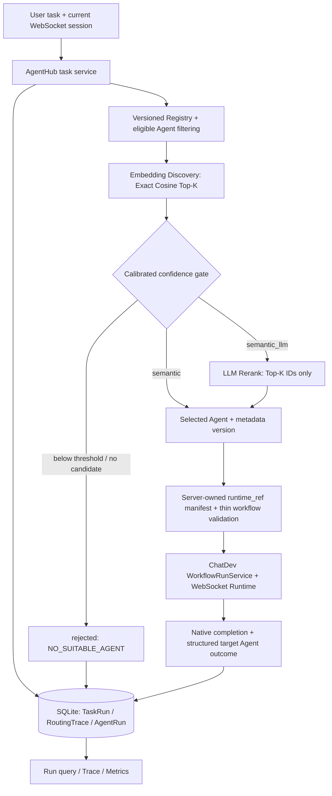

# AgentHub

[English](README.md) | **简体中文**

**面向 Agent 注册、能力发现、动态路由、执行与可观测性的 Agent 平台。**
Based on [OpenBMB/ChatDev 2.0](https://github.com/OpenBMB/ChatDev)（DevAll）。

用户只需描述任务，无需事先知道应调用哪个 Agent。AgentHub 检索已登记的能力元数据，选择一个合适的 Agent，通过 ChatDev 执行其受控 Workflow，并记录路由决策与业务结果。这是面向**可信本地/内部环境**的 P0 工程项目，包含六个示例 Agent 和可复现的评测证据。

**P0 已发布 v1.0.0。** `main` 为稳定分支；`agenthub-dev` 承载后续文档与开发变更。[Release Notes](docs/RELEASE_NOTES.md) · [部署指南](docs/agenthub.md) · [Benchmark](evaluation/README.md) · [Demo](demo/README.md)

## 项目演示与实际界面

**[观看 225 秒 Demo — MP4，1280×720，约 1.4 MiB](demo/agenthub_t48_demo.mp4)**

录屏展示实际 Registry UI、任务提交、候选与所选 Agent、原生执行输出及独立的业务状态。内容包括一次新的 UI 提交、已完成真实 Provider Run 的回放/查询、Registry 禁用与恢复操作，以及实测证据看板；不代表所有展示的 Run 都在录制期间重新执行。

- **Registry**（`/agenthub/registry`）：查看六个 Agent 及能力，禁用并恢复 Data Agent。
- **Launch**（`/launch`）：提交任务、查看路由，并对照 ChatDev 输出与 AgentHub 状态。
- **四类场景**：明确任务、需要重排的模糊任务、无匹配拒绝，以及禁用 Agent 后路由发生变化。

[T48 原始记录](demo/t48_evidence_2026-10-09.json)包含**五条验收 Run：4 success、1 rejected**。这是合成 Demo 场景，不是生产业务成功率，也不是独立答案质量评测。详见[录制范围与复现说明](demo/README.md)。

## 核心特性

- **版本化 Agent Registry**：稳定 Agent 身份、不可变元数据版本、当前版本/状态管理、Embedding 索引、API 与轻量管理界面。
- **Embedding Discovery**：对能力元数据生成向量，过滤 active/current Agent，校验 Workflow 可执行性，通过 Exact Cosine Scan 检索 Top-K。
- **Semantic Routing + 可选 LLM Rerank**：使用校准后的置信度门槛；LLM 只能从已检索的候选 ID 中选择，低置信度请求返回 `NO_SUITABLE_AGENT`。
- **Workflow Execution**：一个任务选择一个 Agent 及其服务端批准的薄 Workflow，复用 ChatDev 执行链。
- **Run State 与失败处理**：持久化 `pending`、`running`、`success`、`failed`、`rejected`、`cancelled`；区分 Provider/Outcome 失败、路由拒绝与已确认取消。
- **Trace 与 Metrics**：记录候选、分数、策略、选择、延迟及安全错误码；汇总计数、显式分母的比率、Agent 使用量及已知/未知 Token 用量。

## 与原版 ChatDev 的差异

| 领域 | 复用 ChatDev 2.0 | AgentHub 二次开发 |
| --- | --- | --- |
| 执行 | YAML Workflow/Runtime、Agent 节点、Provider、工具 | 经校验的 `runtime_ref` → 受控薄 Workflow → 现有执行服务 |
| Agent 选择 | 用户手动选择 Workflow、预配置节点 | 业务 Agent Registry、能力发现、语义路由、可选 Top-K LLM 重排 |
| Web 体验 | FastAPI、Vue 前端、WebSocket 会话、日志/输出、附件、取消 | AgentHub 任务模式、Registry UI、候选/决策展示、业务 Run 查询 |
| 状态与观测 | 原生 Workflow/Session 状态、日志及 Token 跟踪 | SQLite TaskRun/RoutingTrace/AgentRun、结构化成功判定、业务指标 |
| 交付 | 上游源码、示例、资源与部署基础 | 六 Agent 目录、路由评测、集成测试、部署验收与 Demo 证据 |

Workflow Runtime、工作流编辑器和原生工具执行属于上游能力。AgentHub 在应用服务边界扩展平台功能，不替换 Runtime，也不将其声称为原创；手动 YAML 执行入口继续可用。

## 系统架构与任务执行流程



实现入口：[Registry](server/services/agenthub/registry.py) · [Discovery](server/services/agenthub/discovery.py) · [Router](server/services/agenthub/router.py) · [执行适配](server/services/agenthub/workflow_dispatcher.py) · [Metrics](server/services/agenthub/metrics.py)。

`workflow_completed != execution_success`：业务成功需要 Workflow 正常完成，**且**所选目标 Agent 返回有效的结构化成功 Outcome，并且没有失败/取消信号。缺少 Outcome 会明确失败；发出取消请求本身不等于已确认取消。完整契约见[部署与状态指南](docs/agenthub.md)。

新增 Agent 需要元数据以及**经批准的服务端 Workflow/manifest 条目**，无需为 Agent 名称增加 Router 分支；这不意味着允许任意上传的 Workflow 或用户提供的文件路径直接执行。

## 技术栈

- **后端与运行时**：Python 3.12、FastAPI、Pydantic 2、ChatDev YAML Workflow 与 WebSocket 执行链。
- **Registry 与状态**：SQLite WAL，版本化元数据、Embedding 索引和持久化业务 Run。
- **检索与排序**：Exact Cosine Scan，兼容 OpenAI 接口的 Embedding/Rerank 适配器；T43 使用 DashScope `text-embedding-v4`（1024 维）和 DeepSeek `deepseek-flash`。
- **前端与部署**：Vue 3、Vite、Node.js 24、Docker Compose。
- **验证**：pytest、Node test runner、合成标注路由数据集及已归档的 live/offline 证据。

## Docker Quick Start

前提：Git、带 Compose 插件的 Docker Engine，以及有效的 Provider 访问配置。Docker 提供 Python/Node 环境。以下命令从仓库根目录执行：

```bash
git clone https://github.com/hongmuyu/AgentHub.git
cd AgentHub
# 保留已有私有配置。
[ -f .env ] || cp .env.example .env
```

**启动前在本机私下编辑已忽略的 `.env`。** 为聊天 Provider 设置 `BASE_URL`、`API_KEY`、`MODEL_NAME`，模型必须由该 Provider 支持；六个 Demo Workflow 均依赖这些变量。模板含占位符，单独复制模板不会启用 AgentHub。补充以下与已归档 T43 校准一致的非秘密 Embedding 配置：

```dotenv
AGENTHUB_EMBEDDING_BASE_URL=https://dashscope.aliyuncs.com/compatible-mode/v1
AGENTHUB_EMBEDDING_MODEL=text-embedding-v4
AGENTHUB_EMBEDDING_MODEL_KEY=qwen-text-embedding-v4-1024
AGENTHUB_EMBEDDING_DIMENSIONS=1024
AGENTHUB_EMBEDDING_API_KEY_ENV=DASHSCOPE_API_KEY
```

另在私有 `.env` 中设置真实 `DASHSCOPE_API_KEY`。若启用可选的 `semantic_llm` 路由，再加入以下配置和真实 `DEEPSEEK_API_KEY`：

```dotenv
AGENTHUB_RERANK_BASE_URL=https://api.deepseek.com
AGENTHUB_RERANK_MODEL=deepseek-flash
AGENTHUB_RERANK_API_KEY_ENV=DEEPSEEK_API_KEY
```

`*_API_KEY_ENV` 的值是**凭据环境变量的名称**，不是密钥。启动时会依据[冻结校准文件](evaluation/t43_live_calibration_2026-10-08.json)核对端点、模型及向量空间配置；更换这些设置可能触发 `AGENTHUB_CALIBRATION_MISMATCH`。换模型需要相应校准，不能沿用旧阈值；仅轮换凭据不影响该指纹。实际运行仍要求 Provider/模型可用，历史评测不保证其未来可用性。

[compose.yml](compose.yml) 依次加载 `.env` 与已跟踪的非秘密 [.env.docker](.env.docker)。保留后者的 Docker 网络配置，避免出现冲突的 Provider 变量；不要打印或提交展开后的环境值。

```bash
docker compose config --quiet
docker compose build backend frontend
docker compose up -d
docker compose ps
curl -fsS --retry 12 --retry-delay 1 --retry-connrefused http://localhost:6400/health
```

打开 [Launch](http://localhost:5173/launch) 或 [Registry](http://localhost:5173/agenthub/registry)。这是启动后才可访问的本地地址，前端/后端默认端口为 `5173`/`6400`。配置与重启检查见[部署指南](docs/agenthub.md)。此方案面向本地开发演示，不是加固后的公网服务部署。

## Agent 注册与任务运行示例

登记六个已审阅的示例：Research、Code、Data、Document、Planning、Review。登记会校验[受控 manifest](yaml_instance/agenthub_manifest.json)与薄 Workflow，并调用配置的 Embedding Provider 建立索引。

```bash
docker compose exec -T backend python -m server.services.agenthub.demo_catalog
curl -fsS 'http://localhost:6400/api/agenthub/agents?limit=100'
curl -fsS http://localhost:6400/api/agenthub/metrics
```

重复登记相同目录会保留 Agent UUID/version；若已有目录发生冲突，需要显式协调。六个 Agent 是普通示例，不是硬编码的支持类型。Registry 生命周期操作见 [API 与部署指南](docs/agenthub.md)。

1. 在 `/launch` 选择 **AgentHub task**，选择 `semantic` 或已配置的 `semantic_llm`。
2. 提交合成任务：“Given synthetic response times 10, 11, 12, 13, and 80 ms, compute the median and range and identify the value needing outlier review.”（计算所给响应时间的中位数、极差，并找出需复核的异常值。）
3. 查看候选、所选 Agent、原生输出和业务状态；真实重跑的选择与输出可能变化。
4. 使用返回的 `run_id` 调用 `GET /api/agenthub/tasks/{run_id}`，查询持久化 Run 与 Trace。

`POST /api/agenthub/tasks` 要求**真实且当前有效的 WebSocket `session_id`**，由 UI 建立；HTTP 202 仅表示已接受，不表示执行成功。选择 **Manual YAML** 可使用原版 ChatDev 流程；工作流编辑器仍位于 `/workflows`。

## 真实 Benchmark 与延迟权衡

T43 使用 **60 条合成标注样例**：36 clear、12 ambiguous、12 no-match；划分为 **30 calibration / 30 independent test**，每部分为 18/6/6。仅用 calibration 选择 **K=5**、阈值 **0.35727615782291194**，在运行测试前冻结。

以下为 **2026-10-08 真实路由测试**，使用 DashScope Embedding 与 DeepSeek Rerank。来源：[校准 JSON](evaluation/t43_live_calibration_2026-10-08.json)、[含逐条结果的测试 JSON](evaluation/t43_live_test_2026-10-08.json)、[方法与复现说明](evaluation/README.md)。

| 独立测试指标 | Semantic | Semantic + LLM Rerank |
| --- | ---: | ---: |
| Top-1 Routing Accuracy（可匹配样例） | 11/24 (45.83%) | 18/24 (75.00%) |
| Semantic Top-K Recall | 24/24 | 24/24 |
| Reject Accuracy | 3/6 | 3/4 |
| False Accept Rate | 3/6 | 1/4 |
| 基础设施错误 | 0 | 2 |
| Query-to-decision p50 / p95 | 368.009 / 643.426 ms | 2199.482 / 10066.879 ms |

每个策略有 30 个实测路由延迟样本，包含错误调用。两次 Rerank 错误均为 no-match 样例上的 `RERANK_TRUNCATED_RESPONSE`，从质量比率分母中排除，因此是 `/4` 而不是 `/6`。在这批样例上，重排选中了更多正确的 Top-1 Agent，但延迟更高，也出现了 Provider 错误。

[前一次尝试](evaluation/t43_live_test_attempt1_2026-10-08.json)在 512-token 输出上限下有七次截断。此处报告的运行在将传输输出上限调为 2048 后复用了测试集，仍有两次错误；没有用测试标签重新调 K/阈值。这是小规模留出路由样本，不能宣称为完全未复用的一次性质量研究、统计显著性结论或 SLA。

[10/50/100 Agent 真实规模报告](evaluation/t43_live_catalog_size_2026-10-08.json)使用合成元数据、真实 Provider 调用，以独立的 K=3、threshold=-1 配置测量延迟。[离线报告](evaluation/t43_offline_catalog_size_2026-10-08.json)使用 fake embeddings/本地重排，不能称为 live 性能；两者均不验证并发承载能力。

**Routing Accuracy ≠ 执行成功率 ≠ Task Quality。** 该路由 Benchmark 不执行 Workflow。Task Quality 尚未独立评测；T48 的 4 success / 1 rejected 是另一组执行演示记录。

## 测试与验收证据

- **T46 部署**：标准后端/前端镜像构建、真实目录登记与任务执行，以及后端重启后已完成 Run 的查询一致性。[验收记录与命令](docs/agenthub.md)。
- **T48 Demo**：实际 UI 录屏、五条验收 Run 的业务/原生状态证据。[Demo 指南](demo/README.md)。
- **2026-10-10 仓库审计**：Python **634 passed、2 skipped**，排除 `tests/test_websocket_send_message_sync.py`；前端 **42 passed**；Compose 配置检查通过。这些是注明日期的审计结果，不是本次 README 更新重新测得的 live 结果。[审计详情](docs/REPOSITORY_AUDIT.md)。

已安装宿主机开发依赖时，可从仓库根目录复现限定范围的自动化检查：

```bash
env -u AGENTHUB_EMBEDDING_LIVE -u AGENTHUB_RERANK_LIVE PYTHONDONTWRITEBYTECODE=1 \
  timeout 120s .venv/bin/python -m pytest -q \
  --ignore=tests/test_websocket_send_message_sync.py -p no:cacheprovider
node --test frontend/tests/*.test.js
docker compose config --quiet
```

**完整 Python 套件：NOT VERIFIED。** 继承的 WebSocket 测试夹具阻塞完整套件完成，不能把通过的子集称为全量通过；两个跳过项需要显式启用 live Provider 测试。审计还记录了宿主机已有 `frontend/dist` 的权限问题：同一前端构建改用新的临时输出目录后通过，未修改已有目录权限。

## 已知限制

- P0 **一个任务选择一个 Agent**；不包含动态 Agent Team、分布式调度、多租户/RBAC 或不可信公网 Agent 上传。
- SQLite + Exact Cosine Scan 面向当前小目录；PostgreSQL/Qdrant、生产吞吐量与并发保证不属于已验证 P0 范围。
- 持久化业务 Run 可在重启后查询；正在执行的 Provider/工具调用及原生内存 WebSocket 会话不能恢复执行。
- Provider/Rerank 错误记录为失败；P0 没有自动切换第二 Agent 或复杂重试链。
- Token 用量未知时保持未知；结构化执行成功不证明答案质量。
- 任务文本会本地持久化并发送到 Embedding Provider；可选重排还会将任务文本与候选元数据发送给 LLM。使用获准数据，私有 `.env`、SQLite 文件和用户产物不进入 Git。
- 完整 Python 验证及继承的文档/构建问题仍按[仓库审计](docs/REPOSITORY_AUDIT.md)单列。

## 文档导航

- [部署、API 用法、状态语义与 T46 验收](docs/agenthub.md)
- [P0 冻结设计](AGENTHUB_DESIGN.md) · [T00–T49 任务证据](TASKS.md)
- [评测方法、原始结果与复现](evaluation/README.md)
- [Demo 场景、录屏与复现](demo/README.md)
- [P0 Release Notes](docs/RELEASE_NOTES.md)
- [简历项目材料](docs/PORTFOLIO.md) · [面试指南](docs/INTERVIEW_GUIDE.md)
- [仓库审计与继承问题](docs/REPOSITORY_AUDIT.md)
- [ChatDev 用户指南：手动 Workflow 与工具](docs/user_guide/zh/index.md)

## 上游致谢与许可证

AgentHub 基于 **OpenBMB/ChatDev 2.0（DevAll）**，导入基线为 `4fb2db0ea90375ce1059f44fe03ffbd191a7a169`。原版 Runtime、Workflow 系统、前端、工具和资源归功于 OpenBMB/ChatDev 作者与贡献者；AgentHub 的平台扩展范围已在上文列明。

**Copyright 2025 OpenBMB.** 保留上游版权声明、[Apache-2.0 LICENSE](LICENSE)及源码/资源中的许可声明。上游历史、论文、作者/贡献者信息与引用方式请参阅 [ChatDev 官方仓库](https://github.com/OpenBMB/ChatDev)。本 README 已为 AgentHub 衍生项目重写，上游资源与 Git 历史保留。
