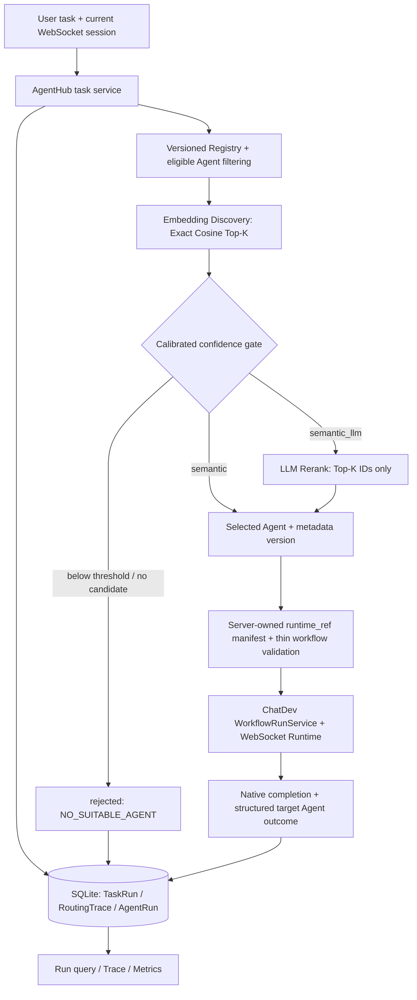

# AgentHub

**English** | [简体中文](README-zh.md)

**An Agent platform for registration, capability discovery, dynamic routing, execution, and observability.**
Based on [OpenBMB/ChatDev 2.0](https://github.com/OpenBMB/ChatDev) (DevAll).

AgentHub lets a user describe a task without knowing which Agent to call. It searches registered capability metadata, selects one eligible Agent, executes its approved workflow through ChatDev, and records the routing decision and business outcome. It is a P0 engineering project for **trusted local/internal use**, with six example Agents and reproducible evaluation evidence.

**P0: v1.0.0 released.** `main` is the stable branch; `agenthub-dev` contains ongoing documentation/development changes. [Release notes](docs/RELEASE_NOTES.md) · [Setup guide](docs/agenthub.md) · [Benchmark](evaluation/README.md) · [Demo](demo/README.md)

## Demo and actual interface

**[Watch the 225-second Demo — MP4, 1280×720, about 1.4 MiB](demo/agenthub_t48_demo.mp4)**

The screen recording shows the actual Registry UI, task submission, candidates and selected Agent, native execution output, and separate business status. It combines a fresh UI submission, replay/query of completed real-provider runs, Registry disable/restore actions, and a measured evidence board. It is not a claim that every displayed run was newly executed during the recording.

- **Registry** (`/agenthub/registry`): inspect six Agents and their capabilities; disable and restore Data Agent.
- **Launch** (`/launch`): submit a task, inspect routing, and view ChatDev output alongside AgentHub state.
- **Four scenarios**: a clear task, an ambiguous task with reranking, a no-match rejection, and changed routing after an Agent is disabled.

The [T48 original record](demo/t48_evidence_2026-10-09.json) contains **five acceptance runs: 4 success, 1 rejected**. These are synthetic Demo scenarios, not a production success rate or independent answer-quality evaluation. See the [recording scope and reproduction instructions](demo/README.md).

## Core features

- **Versioned Agent Registry** — stable Agent identity, immutable metadata versions, current-version/status management, embedding index, API and a minimal administrator UI.
- **Embedding Discovery** — capability metadata embeddings, active/current Agent filtering, workflow eligibility checks, and Exact Cosine Scan for Top-K retrieval.
- **Semantic Routing + optional LLM Rerank** — a calibrated confidence gate; the LLM can choose only among retrieved candidate IDs. Low-confidence requests become `NO_SUITABLE_AGENT`.
- **Workflow Execution** — one task selects one Agent and its server-approved thin workflow; the existing ChatDev execution chain handles the workflow.
- **Run State and failure handling** — persistent `pending`, `running`, `success`, `failed`, `rejected`, `cancelled`; provider/outcome failures and confirmed cancellation stay distinct.
- **Trace and Metrics** — candidates, scores, strategy, selection, latency and safe errors; aggregate counts, rates with explicit denominators, Agent usage and known/unknown token usage.

## What AgentHub adds to ChatDev

| Area | Reused from ChatDev 2.0 | AgentHub secondary development |
| --- | --- | --- |
| Execution | YAML Workflow/Runtime, Agent nodes, providers, tools | Validated `runtime_ref` → approved thin workflow → existing execution service |
| Agent selection | User-selected/manual workflows and configured nodes | Business Agent Registry, capability discovery, semantic routing and optional Top-K LLM reranking |
| Web experience | FastAPI, Vue frontend, WebSocket sessions, logs/output, attachments, cancellation | AgentHub task mode, Registry UI, candidate/decision display and business-run query |
| State and observation | Native workflow/session status, logging and token tracking | SQLite TaskRun/RoutingTrace/AgentRun, structured success checks and business metrics |
| Delivery | Upstream source, examples, resources and deployment foundation | Six-Agent catalog, routing evaluation, integration tests, deployment acceptance and Demo evidence |

Workflow Runtime, the workflow editor and native tool execution are upstream capabilities. AgentHub extends the application-service boundary rather than replacing the runtime or claiming it as original work. Manual YAML execution remains available.

## Architecture and execution flow



Implementation: [Registry](server/services/agenthub/registry.py) · [Discovery](server/services/agenthub/discovery.py) · [Router](server/services/agenthub/router.py) · [execution adapter](server/services/agenthub/workflow_dispatcher.py) · [Metrics](server/services/agenthub/metrics.py).

`workflow_completed != execution_success`: business success requires normal workflow completion **and** a valid successful structured outcome from the selected target Agent, without a failure/cancellation signal. Missing outcomes fail explicitly. A cancel request alone is not confirmed cancellation. The [setup/state guide](docs/agenthub.md) explains the contracts.

Adding an Agent requires metadata plus an **approved server-owned workflow/manifest entry**. It does not require a Router branch for its name, and it does not permit arbitrary uploaded workflows or user-supplied filesystem paths.

## Technology stack

- **Backend/runtime:** Python 3.12, FastAPI, Pydantic 2, existing ChatDev YAML workflows and WebSocket execution.
- **Registry/state:** SQLite with WAL; versioned metadata, embedding index and persistent business runs.
- **Retrieval/ranking:** Exact Cosine Scan; OpenAI-compatible embedding and rerank adapters. T43 uses DashScope `text-embedding-v4` (1024 dimensions) and DeepSeek `deepseek-flash`.
- **Frontend/deployment:** Vue 3, Vite, Node.js 24, Docker Compose.
- **Verification:** pytest, Node test runner, synthetic labeled routing datasets and checked-in live/offline evidence.

## Docker Quick Start

Prerequisites: Git, Docker Engine with the Compose plugin, and valid provider access. Docker supplies the Python/Node environments. Run from the repository root:

```bash
git clone https://github.com/hongmuyu/AgentHub.git
cd AgentHub
# Preserve an existing private configuration.
[ -f .env ] || cp .env.example .env
```

**Edit the ignored `.env` privately before starting.** Set `BASE_URL`, `API_KEY` and `MODEL_NAME` for a chat model supported by your provider; all six demo workflows require them. The template contains placeholders and does not enable AgentHub by itself. Add the following non-secret embedding configuration, matching the checked-in T43 calibration:

```dotenv
AGENTHUB_EMBEDDING_BASE_URL=https://dashscope.aliyuncs.com/compatible-mode/v1
AGENTHUB_EMBEDDING_MODEL=text-embedding-v4
AGENTHUB_EMBEDDING_MODEL_KEY=qwen-text-embedding-v4-1024
AGENTHUB_EMBEDDING_DIMENSIONS=1024
AGENTHUB_EMBEDDING_API_KEY_ENV=DASHSCOPE_API_KEY
```

Also set your actual `DASHSCOPE_API_KEY` in the private `.env`. For optional `semantic_llm` routing, add this block and your actual `DEEPSEEK_API_KEY`:

```dotenv
AGENTHUB_RERANK_BASE_URL=https://api.deepseek.com
AGENTHUB_RERANK_MODEL=deepseek-flash
AGENTHUB_RERANK_API_KEY_ENV=DEEPSEEK_API_KEY
```

The `*_API_KEY_ENV` values are **names of credential variables**, not keys. Startup checks the endpoint/model/vector-space configuration against [frozen calibration](evaluation/t43_live_calibration_2026-10-08.json). Changing those settings can cause `AGENTHUB_CALIBRATION_MISMATCH`; another model requires corresponding calibration, not reuse of the old threshold. Credential rotation alone does not change this fingerprint. Provider/model availability is required; the historical evaluation does not guarantee future availability.

[compose.yml](compose.yml) loads `.env` then the checked-in, non-secret [.env.docker](.env.docker). Keep the latter's Docker network settings; avoid conflicting provider variables. Do not print or commit the expanded environment.

```bash
docker compose config --quiet
docker compose build backend frontend
docker compose up -d
docker compose ps
curl -fsS --retry 12 --retry-delay 1 --retry-connrefused http://localhost:6400/health
```

Open [Launch](http://localhost:5173/launch) or the [Registry](http://localhost:5173/agenthub/registry). These are local addresses available after startup; the default frontend/backend ports are `5173`/`6400`. See [deployment details](docs/agenthub.md) for configuration and restart checks. This is a local development deployment, not a hardened public service.

## Register Agents and run a task

Register the six reviewed fixtures: Research, Code, Data, Document, Planning and Review. Registration validates the [controlled manifest](yaml_instance/agenthub_manifest.json) and thin workflows, and calls the configured embedding provider to create the index.

```bash
docker compose exec -T backend python -m server.services.agenthub.demo_catalog
curl -fsS 'http://localhost:6400/api/agenthub/agents?limit=100'
curl -fsS http://localhost:6400/api/agenthub/metrics
```

An identical catalog preserves Agent UUID/version on repeat registration; conflicts require explicit reconciliation. The six Agents are ordinary fixtures, not hardcoded supported types. Registry lifecycle operations are documented in the [API and setup guide](docs/agenthub.md).

1. At `/launch`, choose **AgentHub task** and `semantic` or, when configured, `semantic_llm`.
2. Submit: “Given synthetic response times 10, 11, 12, 13, and 80 ms, compute the median and range and identify the value needing outlier review.”
3. Inspect candidates, selected Agent, native output and business status. Selection/output can vary on a live rerun.
4. Use the returned `run_id` with `GET /api/agenthub/tasks/{run_id}` to query the persisted run and trace.

`POST /api/agenthub/tasks` requires a **real current WebSocket `session_id`**; the UI establishes it. HTTP 202 means accepted, not successful. Select **Manual YAML** for the original ChatDev flow; the workflow editor remains at `/workflows`.

## Real benchmark and latency tradeoffs

T43 uses **60 synthetic labeled cases**: 36 clear, 12 ambiguous and 12 no-match. It splits them into **30 calibration / 30 independent test** cases (18/6/6 each). Only calibration selected **K=5**, threshold **0.35727615782291194**, frozen before test execution.

The following is the **2026-10-08 live routing test**, using DashScope embeddings and DeepSeek reranking. Sources: [calibration JSON](evaluation/t43_live_calibration_2026-10-08.json), [test JSON with per-case results](evaluation/t43_live_test_2026-10-08.json), [methodology and reproduction](evaluation/README.md).

| Independent test metric | Semantic | Semantic + LLM Rerank |
| --- | ---: | ---: |
| Top-1 Routing Accuracy (matchable cases) | 11/24 (45.83%) | 18/24 (75.00%) |
| Semantic Top-K Recall | 24/24 | 24/24 |
| Reject Accuracy | 3/6 | 3/4 |
| False Accept Rate | 3/6 | 1/4 |
| Infrastructure errors | 0 | 2 |
| Query-to-decision p50 / p95 | 368.009 / 643.426 ms | 2199.482 / 10066.879 ms |

Each strategy has 30 measured routing-latency samples, including error calls. The two rerank errors were `RERANK_TRUNCATED_RESPONSE` on no-match cases; they are excluded from quality-rate denominators, explaining `/4` rather than `/6`. Reranking selected more correct Top-1 Agents on this sample, at higher latency and with provider errors.

A [prior attempt](evaluation/t43_live_test_attempt1_2026-10-08.json) had seven truncated rerank outputs at a 512-token limit. The reported run reused the test split after raising that transport limit to 2048 and still had two errors; K/threshold were not retuned on test labels. This is a small held-out routing sample, not a pristine one-shot quality study, statistical-significance claim or SLA.

The [10/50/100-Agent live catalog-size report](evaluation/t43_live_catalog_size_2026-10-08.json) measures latency on synthetic metadata with real provider calls under a separate K=3, threshold=-1 configuration. The [offline report](evaluation/t43_offline_catalog_size_2026-10-08.json) uses fake embeddings/local reranking and must not be presented as live performance. Neither measures concurrent-load capacity.

**Routing Accuracy ≠ execution success ≠ Task Quality.** This benchmark does not execute workflows. Task Quality has not been independently evaluated; the T48 Demo's 4 success / 1 rejected record is a separate execution demonstration.

## Tests and acceptance evidence

- **T46 deployment:** standard backend/frontend image builds, live catalog registration, task execution and completed-run query consistency after backend restart. [Recorded acceptance and commands](docs/agenthub.md).
- **T48 Demo:** actual UI recording and five acceptance runs with business/native state evidence. [Demo guide](demo/README.md).
- **2026-10-10 repository audit:** Python **634 passed, 2 skipped**, excluding `tests/test_websocket_send_message_sync.py`; frontend **42 passed**; Compose validation passed. These are dated audit results, not new live-provider results from this README update. [Audit details](docs/REPOSITORY_AUDIT.md).

With the host development dependencies installed, reproduce the bounded automated checks from the repository root:

```bash
env -u AGENTHUB_EMBEDDING_LIVE -u AGENTHUB_RERANK_LIVE PYTHONDONTWRITEBYTECODE=1 \
  timeout 120s .venv/bin/python -m pytest -q \
  --ignore=tests/test_websocket_send_message_sync.py -p no:cacheprovider
node --test frontend/tests/*.test.js
docker compose config --quiet
```

**Full Python suite: NOT VERIFIED.** The inherited WebSocket test fixture blocks full-suite completion; a passing subset is not a full-suite pass. The two skipped tests require explicit live-provider opt-in. The audit also records a host-owned `frontend/dist` permission issue: the same frontend build passed with a fresh temporary output directory; the existing directory's permissions were not changed.

## Known limitations

- P0 selects **one Agent per task**. No dynamic teams, distributed scheduling, multi-tenancy/RBAC or untrusted public Agent uploads.
- SQLite + Exact Cosine Scan serves the current small catalog; PostgreSQL/Qdrant, production throughput and concurrency guarantees are outside verified P0 scope.
- Persisted business runs survive restart for queries; in-flight provider/tool calls and native in-memory WebSocket sessions do not resume.
- Provider/rerank failures are recorded as failures; P0 has no automatic secondary-Agent fallback or complex retry chain.
- Unknown token usage remains unknown; structured execution success does not prove answer quality.
- Task text is persisted locally and sent to the embedding provider; optional reranking sends task text and candidate metadata to the LLM. Use approved data and keep private `.env`, SQLite files and user artifacts out of Git.
- Full Python verification and inherited documentation/build issues remain as classified in the [repository audit](docs/REPOSITORY_AUDIT.md).

## Documentation

- [Setup, API usage, state semantics and T46 acceptance](docs/agenthub.md)
- [Frozen P0 design](AGENTHUB_DESIGN.md) · [T00–T49 task evidence](TASKS.md)
- [Evaluation methodology, raw results and reproduction](evaluation/README.md)
- [Demo scenarios, recording and reproduction](demo/README.md)
- [P0 Release Notes](docs/RELEASE_NOTES.md)
- [Portfolio material](docs/PORTFOLIO.md) · [Interview guide](docs/INTERVIEW_GUIDE.md)
- [Repository audit and inherited issues](docs/REPOSITORY_AUDIT.md)
- [ChatDev user guide: manual workflows and tools](docs/user_guide/en/index.md)

## Upstream attribution and license

AgentHub is based on **OpenBMB/ChatDev 2.0 (DevAll)**, using imported baseline `4fb2db0ea90375ce1059f44fe03ffbd191a7a169`. Credit for the original runtime, workflow system, frontend, tools and resources belongs to the OpenBMB/ChatDev authors and contributors. AgentHub's platform additions are described above.

**Copyright 2025 OpenBMB.** The upstream copyright notice and [Apache-2.0 LICENSE](LICENSE) are retained, together with source/resource license notices. See the [official ChatDev repository](https://github.com/OpenBMB/ChatDev) for upstream history, papers, author/contributor information and citation guidance. This README has been rewritten for the AgentHub derivative project; upstream resources and Git history are preserved.
