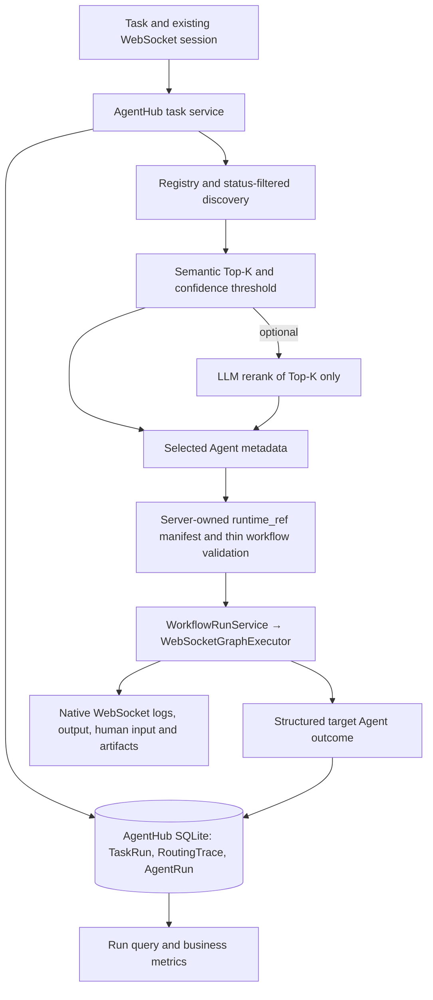

# AgentHub: verified setup and evidence

AgentHub extends ChatDev 2.0 for a **trusted local/internal environment**. It registers business Agent metadata, discovers eligible capabilities, routes one natural-language task to one Agent, and starts that Agent's allowlisted thin workflow through the existing Web execution chain. The [frozen design](../AGENTHUB_DESIGN.md) defines the contracts; this guide describes the implementation and evidence available on `agenthub-dev` as of 2026-10-09. The [original ChatDev guide](../README.md) remains applicable to manual workflows.

## Architecture and boundaries



The [Registry](../server/services/agenthub/registry.py) versions metadata and its embedding index in SQLite. [Discovery](../server/services/agenthub/discovery.py) filters status and validates the workflow target; [routing](../server/services/agenthub/router.py) uses capability metadata rather than six name-based branches. `semantic` selects from the semantic candidates; optional `semantic_llm` reranks **only** that Top-K. A low-confidence match becomes `NO_SUITABLE_AGENT`. The [manifest](../yaml_instance/agenthub_manifest.json) maps logical `workflow://.../1` references to six server-owned YAML files; clients cannot provide arbitrary paths for AgentHub execution. Adding a compatible Agent means registering metadata and an approved thin workflow/manifest entry, without changing Router branches.

The [adapter](../server/services/agenthub/workflow_dispatcher.py) passes the selected workflow into the existing `WorkflowRunService` → WebSocket execution path. `run_id` identifies the persisted AgentHub business run; `session_id` belongs to the existing WebSocket session. Native logs/output, human input, attachments, download, and cancellation remain native ChatDev mechanisms. The manual YAML path still uses `/api/workflow/execute` and has no AgentHub routing requirement.

## Standard Docker setup

From the repository root, use [Dockerfile](../Dockerfile), [frontend/Dockerfile](../frontend/Dockerfile), and [compose.yml](../compose.yml) without image overrides or a host `node_modules` mount. The Compose frontend has its own anonymous `/app/node_modules` volume. Backend and frontend are exposed on ports `6400` and `${FRONTEND_PORT:-5173}` respectively.

Create a local, untracked `.env` from [.env.example](../.env.example) if needed, then set these **variable names** for the six live demo workflows and AgentHub. Never put real credentials in tracked files:

| Purpose | Required configuration |
| --- | --- |
| Chat execution | `BASE_URL`, `API_KEY`, `MODEL_NAME` (a model actually supported by that chat endpoint) |
| Embedding/index | `AGENTHUB_EMBEDDING_BASE_URL`, `AGENTHUB_EMBEDDING_MODEL`, `AGENTHUB_EMBEDDING_MODEL_KEY`, `AGENTHUB_EMBEDDING_DIMENSIONS`, `AGENTHUB_EMBEDDING_API_KEY_ENV`, and the named credential variable |
| Optional LLM rerank | `AGENTHUB_RERANK_BASE_URL`, `AGENTHUB_RERANK_API_KEY_ENV`, the named credential variable, and optionally `AGENTHUB_RERANK_MODEL` (default `deepseek-flash`) |

The verified T43 setup uses a DashScope embedding endpoint, model key `qwen-text-embedding-v4-1024`, 1024 dimensions, and selector `AGENTHUB_EMBEDDING_API_KEY_ENV=DASHSCOPE_API_KEY`; the reranker uses a DeepSeek HTTPS endpoint, `deepseek-flash`, and `AGENTHUB_RERANK_API_KEY_ENV=DEEPSEEK_API_KEY`. These selectors name environment variables; they are **not credential values**. Set the actual model and endpoint in the private `.env`. AgentHub startup checks the non-secret embedding/rerank configuration fingerprints against the [frozen T43 calibration](../evaluation/t43_live_calibration_2026-10-08.json); changing the endpoint, model/model key, or dimensions invalidates that calibration and can stop startup with `AGENTHUB_CALIBRATION_MISMATCH`. Credential rotation alone is not part of that fingerprint. If AgentHub embedding variables are all absent, ordinary ChatDev startup still works, while AgentHub task/Registry services are unavailable. Compose loads `.env` and then `.env.docker`; check for conflicting variable **names** there before startup. Avoid printing the effective Compose environment, which can contain secrets.

```bash
# Run from the repository root. Edit .env privately after copying it.
cp -n .env.example .env
docker compose config --quiet
docker compose build backend frontend
docker compose up -d
docker compose ps
curl -fsS http://localhost:6400/health
```

`docker compose config --quiet` validates Compose without showing credentials. Visit `http://localhost:5173/launch` for tasks and `http://localhost:5173/agenthub/registry` for the Registry UI; use the configured `FRONTEND_PORT` instead of `5173` if changed. The backend is at `http://localhost:6400`.

After both services are healthy, register the six checked-in metadata/thin-workflow fixtures with the standard command. It validates all six workflow targets and uses the configured embedding endpoint to build the index. T46 used the live DashScope endpoint. Repeating the command with an identical catalog preserves UUID/version; a conflicting existing catalog requires an explicit reconciliation, not silent replacement.

```bash
docker compose exec -T backend python -m server.services.agenthub.demo_catalog
curl -fsS 'http://localhost:6400/api/agenthub/agents?limit=100'
curl -fsS http://localhost:6400/api/agenthub/metrics
```

The Registry API at `/api/agenthub/agents` supports register, list/search (`q`, status, paging), get, update, enable, and disable. The UI at `/agenthub/registry` exposes the administrator's catalog view and actions. The catalog command reports six logical `runtime_ref` entries and their actual generated Agent UUID/version pairs; the list API should show six active Agents on a fresh catalog. These six are ordinary examples, not hardcoded supported Agent types.

## Run a task or a manual workflow

1. Open `/launch`, choose **AgentHub task**, choose `semantic` or `semantic_llm`, and submit a natural-language task. For example: “Given synthetic response times 10, 11, 12, 13, and 80 ms, compute the median and range and identify the value needing outlier review.” This is synthetic input, not a guarantee of the selected Agent or answer. The UI creates/reuses the native WebSocket session and uses its session ID.
2. Inspect the semantic candidates, selected Agent, native output/logs, and separate AgentHub business status. The task submission response is acceptance/dispatch, **not** execution success. The UI retains `run_id`; `GET /api/agenthub/tasks/{run_id}` returns the persisted TaskRun, RoutingTrace, and AgentRun when an Agent was started, including after refresh/reconnect. `GET /api/agenthub/metrics` returns aggregate business metrics.
3. To use the original ChatDev flow, choose **Manual YAML** on `/launch`, select a workflow YAML and provide its prompt. The original Workflow editor remains under `/workflows`. Manual execution uses the existing WebSocket session and `/api/workflow/execute`, without creating an AgentHub business run.

The AgentHub submission API is `POST /api/agenthub/tasks` with `task`, a **real current WebSocket** `session_id`, optional uploaded attachment IDs, and `routing_strategy` (`semantic` by default; `semantic_llm` only when configured). It returns HTTP 202 with a `run_id`, routing decision, and initial business status. An arbitrary session ID is insufficient; use the UI or establish `/ws` first. The [task API](../server/routes/agenthub_tasks.py), [Registry API](../server/routes/agenthub.py), [metrics API](../server/routes/agenthub_metrics.py), and [run-query response](../server/services/agenthub/run_query.py) are the exact field contracts.

### Business status and persistence

| Status | Meaning |
| --- | --- |
| `pending` / `running` | Recorded/started; HTTP 202 and native output do not imply success. |
| `success` | Normal workflow completion **and** the unique target Agent's structured `AgentExecutionOutcome=succeeded`, with no prior failure/cancellation. `workflow_completed` alone is insufficient. |
| `failed` | Routing/dispatch/provider/outcome failure; a missing, invalid, wrong-node, or failed structured outcome cannot become success. |
| `rejected` | No suitable eligible Agent above the calibrated threshold (`NO_SUITABLE_AGENT`); no Agent workflow is started. |
| `cancelled` | The existing execution path has confirmed the cancellation boundary. A cancel request alone leaves the run nonterminal; WebSocket disconnect alone does not cancel it. |

Business status is separate from native WebSocket/session status and is terminal once committed. [TaskRun](../server/services/agenthub/task_runs.py), [RoutingTrace](../server/services/agenthub/routing_traces.py), and [AgentRun](../server/services/agenthub/agent_runs.py) persist under `data/agenthub.db` (SQLite WAL). Trace records candidates/scores, routing strategy/latency, selection or safe error; AgentRun records selected Agent/version, native status, structured outcome-related status, latency, and result reference when available. [Metrics](../server/services/agenthub/metrics.py) expose counts, execution success/failure and rejection rates with explicit denominators, measured latency sample counts, known/unknown token usage, Agent usage, and routing distribution. Task-quality success remains `null` without an answer rubric or human assessment.

The standard Compose backend mounts the repository at `/app`, so `data/agenthub.db` and related SQLite WAL files remain on the host across a backend container restart. Do **not** delete `data/`, databases, or Docker volumes to test persistence. After a run has reached a terminal state, the following commands query the same existing records before and after restart; substitute a `run_id` returned by your own task:

```bash
curl -fsS 'http://localhost:6400/api/agenthub/tasks/REPLACE_WITH_RUN_ID'
docker compose restart backend
curl -fsS --retry 12 --retry-delay 1 --retry-connrefused http://localhost:6400/health
curl -fsS 'http://localhost:6400/api/agenthub/tasks/REPLACE_WITH_RUN_ID'
curl -fsS 'http://localhost:6400/api/agenthub/agents?limit=100'
curl -fsS http://localhost:6400/api/agenthub/metrics
```

A persisted `run_id` restores the **query view**; it does not resume an in-flight provider/tool call or the in-memory native WebSocket session after process restart. T46 verified restart query consistency for one completed live AgentHub run, its trace and AgentRun, six Registry entries, and metrics. That check did not establish in-flight execution recovery.

## Routing benchmark reproduction and measured results

The [evaluation guide](../evaluation/README.md) explains the 60 reviewed synthetic labels, metric formulas, error exclusions, complete per-case results, and 10/50/100 catalog-size timings. The checked-in [calibration](../evaluation/t43_live_calibration_2026-10-08.json) and [independent test](../evaluation/t43_live_test_2026-10-08.json) are **live DashScope embeddings + live DeepSeek reranking**, measured 2026-10-08 on Python 3.12.13, Linux 6.8.0-138-generic, 16 logical CPUs (AMD Ryzen 7 8745H). Their artifacts contain source/config hashes, dataset/catalog snapshots, model keys, timing samples and safe error codes; they contain no credentials. Provider load and caches were uncontrolled.

The 60 cases are 36 clear, 12 ambiguous, and 12 no-match, split 30 calibration/30 independent test (18/6/6 per split). **Only calibration** selected K=5 and cosine threshold `0.35727615782291194`; the calibration artifact was written with `frozen_before_test` before either test strategy ran. The selected calibration gate measured Top-1 15/24, Top-K 24/24, reject 4/6, false accept 2/6, with zero infrastructure errors. The independent test then used the same frozen gate:

| Live test strategy | Top-1 | Semantic Top-K recall | Reject accuracy | False accept | Infra errors | Query-to-decision p50/p95 ms |
| --- | ---: | ---: | ---: | ---: | ---: | ---: |
| `semantic` | 11/24 | 24/24 | 3/6 | 3/6 | 0 | 368.009 / 643.426 |
| `semantic_llm` | 18/24 | 24/24 | 3/4 | 1/4 | 2 | 2199.482 / 10066.879 |

Each strategy has 30 measured routing-latency samples, including measured infrastructure-error calls. The two `semantic_llm` errors were truncated DeepSeek responses on no-match cases; they are **excluded** from quality-rate denominators, hence `3/4` and `1/4` rather than `/6`. Its 21 actual rerank calls had transport p50/p95 of 2640.014/9703.747 ms. This is a single 30-case held-out sample per strategy; it measures routing, **not workflow execution or answer quality**, and does not establish statistical significance or an SLA. The prior 512-token [attempt](../evaluation/t43_live_test_attempt1_2026-10-08.json) had seven truncated rerank outputs; the checked-in test used a 2048-token output limit and still had two. K/threshold were not retuned on test labels.

The separate [live catalog-size report](../evaluation/t43_live_catalog_size_2026-10-08.json) uses **synthetic** Agent metadata/queries with real 1024-dimensional embeddings and DeepSeek calls, K=3, threshold=-1, one warmup and 12 measured requests per strategy per size. It measures latency only; no workflow or routing accuracy is measured. Full-route p50/p95 ms were: 10 Agents `semantic` 318.952/617.735, `semantic_llm` 2178.088/3974.995; 50 Agents 439.839/484.852 and 3224.426/10302.801; 100 Agents 439.294/589.729 and 3202.536/10776.190. There were 0, 1, and 2 truncated rerank calls at those sizes respectively. The [deterministic offline report](../evaluation/t43_offline_catalog_size_2026-10-08.json) instead uses fake 16-dimensional embeddings, local identity reranking, two warmups and 36 samples per strategy per size; its latency is **not** live-provider latency. Neither scale report proves routing quality or concurrent-load behavior.

For a new run, supply valid private credentials/configuration and run from the repository root with the project's Python 3.12 environment. These are **explicit opt-in live-provider calls** that incur API use; write new artifacts outside the checked-in evidence to preserve its provenance:

```bash
mkdir -p /tmp/agenthub-t43-reproduction
.venv/bin/python -m evaluation.live_routing_benchmark --output-dir /tmp/agenthub-t43-reproduction
.venv/bin/python -m evaluation.live_catalog_size_benchmark --output /tmp/agenthub-t43-reproduction/live_catalog_size.json
.venv/bin/python -m evaluation.catalog_size_benchmark --output /tmp/agenthub-t43-reproduction/offline_catalog_size.json
```

The first command freezes calibration before test evaluation. It requires DashScope/DeepSeek HTTPS endpoint selectors and the corresponding credentials; do not replace live calls with fake results. The second uses real providers on synthetic catalogs; the third is deterministic offline engineering evidence. New results will differ with provider/network load, hardware, and configuration. Review the `label`, sample counts, errors, model/config fingerprints, and environment fields in each output before comparing it with the checked-in reports.

## Verified deployment scope and limits

T46 checked the repository's **standard** backend and frontend image builds, Compose startup, backend HTTP/WebSocket availability, original Workflow and Manual YAML Launch, AgentHub task entry/Registry UI/metrics, six live-embedding catalog registrations, and a **real provider-backed** task. That task selected the Data Agent, reached business `success` only after a structured target outcome and normal native completion, and its TaskRun/RoutingTrace/AgentRun links and Registry/metrics remained queryable after `docker compose restart backend` (2026-10-09). The manual `demo_loop_counter` workflow was a separate non-provider smoke; its fast-completion UI status race was fixed and rechecked in T46. It is not evidence of LLM quality.

Targeted/backend/frontend checks passed in T46, including standard image builds and frontend build. The wider Python suite excluding `tests/test_websocket_send_message_sync.py` had **629 passed, 2 skipped**; frontend tests had **42 passed**. The **full Python suite remains NOT VERIFIED** because the inherited WebSocket test fixture enters a `MagicMock` reconnect/serialization loop, documented in [DEVELOPMENT_BASELINE.md](../DEVELOPMENT_BASELINE.md). The known fixture issue is separate from the live WebSocket handshake and the verified task path; it was not fixed by changing production WebSocket behavior. The Manual YAML smoke used a non-provider workflow; other chat/embedding/rerank endpoints and models were **NOT VERIFIED** by the single configured live-provider path. External tools/MCP, public untrusted deployment, simultaneous-load limits, process-restart continuation of active runs, and task-answer quality are also **NOT VERIFIED** by these checks.

This is not a public multi-tenant security boundary: no P0 auth, RBAC, or tenant isolation is provided. Task text is persisted in SQLite and sent to the embedding provider; `semantic_llm` also sends it to the reranker along with public candidate metadata. Attachment **contents** are not sent to routing/reranking by default, but uploaded attachment IDs and contents can flow through the selected workflow's existing execution mechanisms. Use only task data and providers permitted by your internal policy. Keep private `.env`, SQLite data, artifacts, logs, and any provider responses out of commits and public reports.
